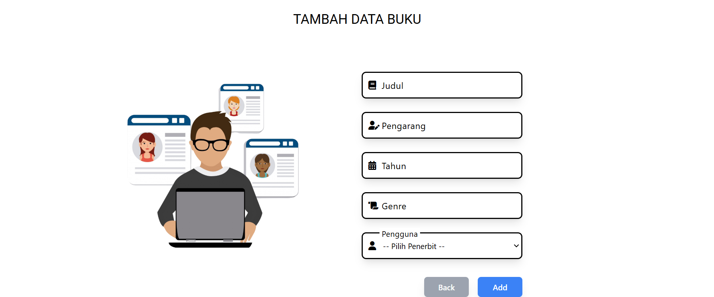

# Praktikum Pemgrograman Web 2 - Sistem Pengelolaan Perpustakaan Digital

## Informasi Umum
Proyek ini merupakan bagian dari Tugas UAS Mata Kuliah Praktikum Pemrograman WEB 2 yang dilakukan oleh kelompok 4 kelas TI-2C Politeknik Negeri Cilacap <br>
Anggota kelompok 4 :
1. Gerin Nurul Ardriyani (230202061)
2. Nalindra Driyawan Thahai (230202070)
3. Kristian Dimas Adi Wicaksono(230302065)
4. Amanda Nur Atika(230

## Deskripsi Proyek
Proyek ini merupakan Sistem Pengelolaan Perpustakaan Digital berbasis web yang dirancang menggunakan arsitektur Model-View-Controller (MVC) dengan menerapkan konsep Pemrograman Berorientasi Objek (OOP). Aplikasi ini bertujuan untuk mempermudah pengelolaan koleksi buku, pengguna, serta aktivitas peminjaman dan pengembalian dalam perpustakaan secara digital.

## Tujuan
Tujuan dari praktikum ini adalah untuk memberikan pemahaman yang lebih baik tentang arsitektur MVC dalam pengembangan aplikasi web dan untuk meningkatkan kemampuan mahasiswa dalam menerapkan konsep OOP serta melakukan operasi CRUD (Create, Read, Update, Delete) pada data.

## Membuat Tabel Publishers dalam Database '2C_klp4' <br>

 <br>
Tabel ini digunakan untuk mencatat informasi tentang penerbit buku. Data dalam tabel ini memuat nama penerbit, informasi kontak, dan alamat, sehingga perpustakaan dapat dengan mudah melacak sumber buku yang diterbitkan. Informasi penerbit sering kali digunakan untuk keperluan pencatatan administrasi atau saat ingin menambah koleksi baru. Hubungan antara tabel penerbit dengan tabel buku memastikan setiap koleksi buku memiliki data penerbit yang valid, memudahkan dalam pengelolaan dan pelaporan koleksi. 
<br>

## 1. Models
Script di bawah digunakan untuk mengelola data dalam tabel `publishers` pada database. Kelas ini terhubung ke database melalui konfigurasi di file eksternal dan menyediakan metode CRUD (Create, Read, Update, Delete). Metode `getAllPublishers` mengambil semua data penerbit, sedangkan `find` mencari data berdasarkan ID tertentu. Metode `add` digunakan untuk menambahkan data penerbit baru, sementara `update` memperbarui data penerbit berdasarkan ID, dan `delete` menghapus data penerbit berdasarkan ID. Seluruh operasi menggunakan PDO (PHP Data Objects) dengan parameter yang di-bind untuk menjaga keamanan dari SQL injection.
``` <?php
// app/models/Publishers.php
require_once '../config/database.php';

class Publishers {
    private $db;

    public function __construct() {
        $this->db = (new Database())->connect();
    }

    public function getAllPublishers() {
        $query = $this->db->query("SELECT * FROM publishers");
        return $query->fetchAll(PDO::FETCH_ASSOC);
    }

    public function find($id_penerbit) {
        $query = $this->db->prepare("SELECT * FROM publishers WHERE id_penerbit = :id_penerbit");
        $query->bindParam(':id_penerbit', $id_penerbit, PDO::PARAM_INT);
        $query->execute();
        return $query->fetch(PDO::FETCH_ASSOC);
    }

    public function add($id_penerbit, $nama_penerbit, $alamat, $kontak) {
        $query = $this->db->prepare("INSERT INTO publishers (id_penerbit, nama_penerbit, alamat, kontak) VALUES (:id_penerbit, :nama_penerbit, :alamat, :kontak)");
        $query->bindParam(':id_penerbit', $id_penerbit);
        $query->bindParam(':nama_penerbit', $nama_penerbit);
        $query->bindParam(':alamat', $alamat);
        $query->bindParam(':kontak', $kontak);
        return $query->execute();
    }

    // Update publishers data by ID
    public function update($id_penerbit, $data) {
        $query = "UPDATE publishers SET id_penerbit = :id_penerbit, nama_penerbit = :nama_penerbit, alamat = :alamat, kontak = :kontak WHERE id_penerbit = :id_penerbit";
        $stmt = $this->db->prepare($query);
        $stmt->bindParam(':id_penerbit', $data['id_penerbit']);
        $stmt->bindParam(':nama_penerbit', $data['nama_penerbit']);
        $stmt->bindParam(':alamat', $data['alamat']);
        $stmt->bindParam(':kontak', $data['kontak']);
        $stmt->bindParam(':id_penerbit', $id_penerbit);
        return $stmt->execute();
    }

    // Delete publishers by ID
    public function delete($id_penerbit) {
        $query = "DELETE FROM publishers WHERE id_penerbit = :id_penerbit";
        $stmt = $this->db->prepare($query);
        $stmt->bindParam(':id_penerbit', $id_penerbit);
        return $stmt->execute();
    }
}
```

## 2. Views - Create
Script di bawah ini adalah sebuah halaman formulir HTML untuk menambahkan data penerbit menggunakan framework CSS Tailwind dan ikon Font Awesome. Formulir ini terdiri dari tiga input utama: nama penerbit, alamat, dan kontak, yang masing-masing memiliki ikon, placeholder dinamis, dan validasi wajib diisi (atribut `required`). Tampilan formulir dirancang responsif dengan tata letak modern menggunakan komponen seperti bayangan, animasi hover, dan border dinamis. Selain itu, terdapat tombol "Back" untuk kembali ke halaman sebelumnya dan tombol "Add" untuk mengirim data ke server melalui metode POST ke endpoint `/publishers/store`. Halaman ini juga dilengkapi dengan footer sederhana yang mencantumkan informasi hak cipta dan kontak email kelompok pengembang. Gambar dekoratif hanya ditampilkan pada layar besar untuk mempercantik tampilan.
```<!-- app/views/publishers/create.php -->
<!DOCTYPE html>
<html lang="en">
<head>
    <meta charset="UTF-8">
    <meta name="viewport" content="width=device-width, initial-scale=1.0">
    <title>TAMBAH DATA PENERBIT</title>
    <script src="https://cdn.tailwindcss.com"></script>
    <link href="https://cdnjs.cloudflare.com/ajax/libs/font-awesome/6.0.0-beta3/css/all.min.css" rel="stylesheet">
    <link href="https://fonts.googleapis.com/css2?family=Roboto:wght@400;500;700&display=swap" rel="stylesheet">
</head>
<body>
    <form action="/publishers/store" method="post">
    <div class="flex flex-col items-center justify-center w-full h-screen">
        <!-- Judul -->
        <h1 class="text-center text-2xl font-['Roboto'] font-semiold">TAMBAH DATA PENERBIT</h1>
        <!-- Formulir -->
        <div class="flex mt-12 items-center justify-center w-full">
            
            <div class="flex flex-col gap-6 w-full max-w-md">
                <!-- Nama -->
                <label class="relative flex items-center w-full">
                    <i class="fas fa-user absolute left-3 text-black"></i>
                    <input required type="text" name="nama_penerbit" id="nama_penerbit" class="w-72 pr-3 pl-8 py-2 h-12 text-sm outline-none border-2 border-black rounded-lg hover:border-gray-600 duration-200 peer focus:border-indigo-600 bg-inherit shadow-lg">
                    <span class="absolute left-6 top-3 px-1 text-m tracking-wide peer-focus:text-indigo-600 pointer-events-none duration-200 peer-focus:text-sm peer-focus:-translate-y-5 bg-white ml-2 peer-valid:text-sm peer-valid:-translate-y-5">Nama Penerbit</span>
                </label>
                <!-- Alamat -->
                <label class="relative flex items-center w-full">
                    <i class="fa-solid fa-location-dot absolute left-3 text-black"></i>
                    <input required type="alamat"  name="alamat" id="alamat" class="w-72 pr-3 pl-8 py-2 h-12 text-sm outline-none border-2 border-black rounded-lg hover:border-gray-600 duration-200 peer focus:border-indigo-600 bg-inherit shadow-lg">
                    <span class="absolute left-6 top-3 px-1 text-m tracking-wide peer-focus:text-indigo-600 pointer-events-none duration-200 peer-focus:text-sm peer-focus:-translate-y-5 bg-white ml-2 peer-valid:text-sm peer-valid:-translate-y-5">Alamat</span>
                </label>
                <!-- Kontak -->
                <label class="relative flex items-center w-full">
                    <i class="fa-solid fa-phone absolute left-3 text-black"></i>
                    <input required type="kontak" name="kontak" id="kontak" class="w-72 pr-3 pl-8 py-2 h-12 text-sm outline-none border-2 border-black rounded-lg hover:border-gray-600 duration-200 peer focus:border-indigo-600 bg-inherit shadow-lg">
                    <span class="absolute left-6 top-3 px-1 text-m tracking-wide peer-focus:text-indigo-600 pointer-events-none duration-200 peer-focus:text-sm peer-focus:-translate-y-5 bg-white ml-2 peer-valid:text-sm peer-valid:-translate-y-5">Kontak</span>
                </label>
                <div class="flex gap-4 mt-2 ml-28">
                    <!-- Tombol Back (Link) -->
                    <a href="index" class="w-20 h-9 bg-gray-400 text-white text-sm font-medium rounded-md hover:bg-gray-500 transition duration-300 text-center flex items-center justify-center shadow-lg">Back</a>
                    <!-- Tombol Add -->
                    <button class="w-20 h-9 bg-blue-500 text-white text-sm font-medium rounded-md hover:bg-blue-600 transition duration-300 shadow-lg">Add</button>
                </div>
            </div>
        </div>
        <div class="fixed bottom-0 w-full h-12 bg-gray-300 rounded-md p-2 shadow-md">
        <div class="flex justify-center items-center h-full">
        <footer class="text-xs text-center">
            <p>© 2024 PWEB2<br><a href="mailto:Kel4@example.com" class="text-blue-600 hover:underline flex items-center gap-1"> kel4@example.com</a></p>
        </footer>
    </div>
    </div>
</body>
</html>
```
### Views - Edit
Script ini adalah halaman HTML yang digunakan untuk mengedit data penerbit dalam sistem berbasis web. Formulir utama menampilkan input seperti nama penerbit, alamat, dan kontak yang diisi dengan data penerbit yang ada, ditarik dari PHP menggunakan variabel `$publishers`. Saat pengguna mencoba mengirimkan formulir, modal konfirmasi muncul menggunakan JavaScript untuk meminta konfirmasi sebelum menyimpan perubahan. Tombol-tombol seperti "Back" dan "Save" memberikan navigasi dan pengolahan data. Desainnya responsif dengan ikon dan tampilan modern untuk pengalaman pengguna yang lebih baik, sementara modal memastikan tindakan pengguna divalidasi sebelum data diperbarui ke basis data.
```<!-- app/views/publishers/edit.php -->
<!DOCTYPE html>
<html lang="en">
<head>
    <meta charset="UTF-8">
    <meta name="viewport" content="width=device-width, initial-scale=1.0">
    <title>Edit Penerbit</title>
    <script src="https://cdn.tailwindcss.com"></script>
    <link href="https://cdnjs.cloudflare.com/ajax/libs/font-awesome/6.0.0-beta3/css/all.min.css" rel="stylesheet">
    <link href="https://fonts.googleapis.com/css2?family=Roboto:wght@400;500;700&display=swap" rel="stylesheet">
</head>
<body>
    <form action="/publishers/update/<?php echo $publishers['id_penerbit']; ?>" method="POST">
    <div class="flex flex-col items-center justify-center w-full h-screen">
    <!-- Judul -->
    <h1 class="text-center text-2xl font-['Roboto'] font-semiold">EDIT DATA PENERBIT</h1>
    <!-- Formulir -->
    <div class="flex mt-12 items-center justify-center w-full">
        
        <div class="flex flex-col gap-6 w-full max-w-md">
        <!-- Nama -->
        <label class="relative flex items-center w-full">
            <i class="fas fa-user absolute left-3 text-black"></i>
            <input required type="text" name="nama_penerbit" id="nama_penerbit" value="<?php echo $publishers['nama_penerbit']; ?>" class="w-72 pr-3 pl-8 py-2 h-12 text-sm outline-none border-2 border-black rounded-lg hover:border-gray-600 duration-200 peer focus:border-indigo-600 bg-inherit shadow-lg">
            <span class="absolute left-6 top-3 px-1 text-m tracking-wide peer-focus:text-indigo-600 pointer-events-none duration-200 peer-focus:text-sm peer-focus:-translate-y-5 bg-white ml-2 peer-valid:text-sm peer-valid:-translate-y-5">Nama Penerbit</span>
        </label>
        <!-- Alamat -->
        <label class="relative flex items-center w-full">
            <i class="fa-solid fa-location-dot absolute left-3 text-black"></i>
            <input required type="alamat"  name="alamat" id="alamat" value="<?php echo $publishers['alamat']; ?>" class="w-72 pr-3 pl-8 py-2 h-12 text-sm outline-none border-2 border-black rounded-lg hover:border-gray-600 duration-200 peer focus:border-indigo-600 bg-inherit shadow-lg">
            <span class="absolute left-6 top-3 px-1 text-m tracking-wide peer-focus:text-indigo-600 pointer-events-none duration-200 peer-focus:text-sm peer-focus:-translate-y-5 bg-white ml-2 peer-valid:text-sm peer-valid:-translate-y-5">Alamat</span>
        </label>
        <!-- Kontak -->
        <label class="relative flex items-center w-full">
            <i class="fa-solid fa-phone absolute left-3 text-black"></i>
            <input required type="kontak" name="kontak" id="kontak" value="<?php echo $publishers['kontak']; ?>" class="w-72 pr-3 pl-8 py-2 h-12 text-sm outline-none border-2 border-black rounded-lg hover:border-gray-600 duration-200 peer focus:border-indigo-600 bg-inherit shadow-lg">
            <span class="absolute left-6 top-3 px-1 text-m tracking-wide peer-focus:text-indigo-600 pointer-events-none duration-200 peer-focus:text-sm peer-focus:-translate-y-5 bg-white ml-2 peer-valid:text-sm peer-valid:-translate-y-5">Kontak</span>
        </label>
        <div class="flex gap-4 mt-2 ml-28">
            <!-- Tombol Back (Link) -->
            <a href="../index" class="w-20 h-9 bg-gray-400 text-white text-sm font-medium rounded-md hover:bg-gray-500 transition duration-300 text-center flex items-center justify-center">Back</a>
            <!-- Tombol Add -->
            <button type="submit" class="w-20 h-9 bg-blue-500 text-white text-sm font-medium rounded-md hover:bg-blue-600 transition duration-300">Save</button>
            </div>
        </div>
        <div class="fixed bottom-0 w-full h-12 bg-gray-300 rounded-md p-2 shadow-md">
            <div class="flex justify-center items-center h-full">
                <footer class="text-xs text-center">
                    <p>© 2024 PWEB2<br><a href="mailto:Kel4@example.com" class="text-blue-600 hover:underline flex items-center gap-1"> kel4@example.com</a></p>
                </footer>
            </div>
        </div>
    </div>
</div>
<div id="confirmModal" class="fixed inset-0 bg-black bg-opacity-50 z-50 hidden items-center justify-center">
    <div class="bg-white rounded-lg shadow-xl p-6 w-96">
        <h2 class="text-xl font-bold mb-4 text-center">Konfirmasi Penyimpanan</h2>
        <div id="modalDetails" class="mb-4 text-sm"></div>
        <div class="flex justify-between">
            <button id="cancel" type="button" class="px-4 py-2 bg-gray-300 text-gray-700 rounded hover:bg-gray-400">Batal</button>
            <button id="confirm" type="button" class="px-4 py-2 bg-blue-500 text-white rounded hover:bg-blue-600">Simpan</button>
        </div>
    </div>
</div>
</form>
<script>
document.addEventListener('DOMContentLoaded', function() {
    const form = document.getElementById('publishers');
    const modal = document.getElementById('confirmModal');
    const modalDetails = document.getElementById('modalDetails');
    const confirmBtn = document.getElementById('confirm');
    const cancelBtn = document.getElementById('cancel');

    form.addEventListener('submit', function(event) {
        // Prevent default form submission
        event.preventDefault();
        modalDetails.innerHTML = 'Apakah Anda yakin ingin menyimpan semua perubahan?';

        // Show modal
        modal.classList.remove('hidden');
        modal.classList.add('flex');
        // Confirm button
        confirmBtn.onclick = function() {
            modal.classList.add('hidden');
            modal.classList.remove('flex');
            form.submit();
        };
        // Cancel button
        cancelBtn.onclick = function() {
            modal.classList.add('hidden');
            modal.classList.remove('flex');
        };
    });
});
</script>
        <!-- <tr>
            <td colspan="2" style="text-align: center;">
                <button type="submit">Update</button>
            </td>
        </tr>
    </table>
    </form>
    <a href="/publishers/index">Back to List</a> -->
</body>
</html>
```
### Views - Index
Halaman ini menampilkan tabel data penerbit dengan fitur pencarian, paginasi, serta tombol aksi seperti edit dan hapus. Fungsi pencarian memungkinkan pengguna mencari data tertentu, sedangkan fitur paginasi membatasi jumlah data yang ditampilkan per halaman. Ada modal konfirmasi yang muncul saat pengguna mencoba menghapus data untuk memastikan tindakan tersebut. Script ini juga menggunakan elemen visual responsif, ikon FontAwesome, dan elemen aksesibilitas untuk meningkatkan pengalaman pengguna di berbagai perangkat.
```<!-- app/views/publishers/index.php -->
<!DOCTYPE html>
<html lang="en">
<head>
    <meta charset="UTF-8">
    <meta name="viewport" content="width=device-width, initial-scale=1.0">
    <title>Data Penerbit</title>
    <script src="https://cdn.tailwindcss.com"></script>
    <script src="https://code.jquery.com/jquery-3.6.4.min.js"></script>
    <script src="https://cdn.datatables.net/1.13.6/js/jquery.dataTables.min.js"></script>
    <link rel="stylesheet" href="https://cdn.datatables.net/1.13.6/css/jquery.dataTables.min.css">
    <link href="https://cdnjs.cloudflare.com/ajax/libs/font-awesome/6.0.0-beta3/css/all.min.css" rel="stylesheet">
</head>
<style>
    html, body {
        height: 100%;
        margin: 0;
        overflow: hidden;
    }
</style>
<body class="min-h-screen bg-gray-400">
<!-- Judul -->
<h2 class="pt-8 text-center text-xl font-['Roboto'] font-bold">DAFTAR PENERBIT</h2>
<div class="container mx-auto px-4 flex flex-col min-h-screen">
    <div class="flex-1 flex flex-col items-center">
        <!-- tombol dan search bar -->
        <div class="mt-24 w-3/4">
            <div class="flex justify-end gap-2 items-center">
                <a href="/publishers/create" class="px-5 py-3 bg-blue-500 text-white font-semibold text-sm rounded-lg hover:bg-blue-600 transition duration-300"><i class="fa fa-plus mr-2"></i>Add</a>
                <div class="relative">
                    <input type="text" id="searchInput" placeholder="Cari data..." class="w-48 pl-10 px-4 py-2 border-2 border-gray-300 rounded-lg focus:outline-none focus:ring-2 focus:ring-blue-500">
                    <span class="absolute left-3 top-1/2 transform -translate-y-1/2 text-gray-400">
                        <i class="fas fa-search"></i>
                    </span>
                </div>
            </div>
        </div>
        <div id="no-data-row" class="mt-8 text-center bg-white p-4 rounded-lg shadow-md hidden w-3/4">
            <p class="text-gray-600 text-lg">Data Tidak tersedia</p>
        </div>
        <table id="publishers" class="mt-2 table-auto w-3/4 rounded-lg shadow-lg overflow-hidden text-sm text-left">
            <thead>
                <tr class="bg-gray-300 justify-center">
                <th class="px-4 py-2 text-center">ID Penerbit</th>
                <th class="px-4 py-2 text-center">Nama Penerbit</th>
                <th class="px-4 py-2 text-center">Alamat</th>
                <th class="px-4 py-2 text-center">Kontak</th>
                <th class="px-4 py-2 text-center">Actions</th>
        </tr>
    </thead>
    <tbody>
    <?php foreach ($publishers as $publisher): ?>
        <tr class="odd:bg-gray-100 even:bg-gray-200 hover:bg-gray-300 border-b border-gray-300">
            <td class="px-4 py-2 text-center"><?= htmlspecialchars($publisher['id_penerbit']) ?></td>
            <td class="px-4 py-2 text-center"><?= htmlspecialchars($publisher['nama_penerbit']) ?></td>
            <td class="px-4 py-2 text-center"><?= htmlspecialchars($publisher['alamat']) ?></td>
            <td class="px-4 py-2 text-center"><?= htmlspecialchars($publisher['kontak']) ?></td>
            <td class="px-4 py-2 text-center">
                <a href="/publishers/edit/<?php echo $publisher['id_penerbit']; ?>" class="inline-block px-4 py-2 bg-blue-500 text-white font-semibold text-sm rounded-lg hover:bg-blue-600 focus:outline-none focus:ring-2 focus:ring-blue-500"><i class="fa fa-pen mr-2"></i>Edit</a> |
                <a href="/publishers/delete/<?php echo $publisher['id_penerbit']; ?>" id="delete" class="inline-block px-4 py-2 bg-red-500 text-white font-semibold text-sm rounded-lg hover:bg-red-600 focus:outline-none focus:ring-2 focus:ring-red-500"><i class="fa fa-trash mr-2"></i>Delete</a>
            </td>
        </tr>
    <?php endforeach; ?>
    <tr id="no-data-row" class="hidden">
                    <td colspan="5" class="text-center p-4 bg-white text-gray-600">
                        Tidak ada data yang ditemukan
                    </td>
                </tr>
    </tbody>
    </table>
    <div class="mt-2 flex justify-between w-3/4">
            <a href="./dashboard" class="w-20 h-9 bg-gray-500 text-white text-sm font-medium rounded-md hover:bg-gray-600 transition duration-300 text-center flex items-center justify-center"><i class="fa fa-arrow-left mr-2"></i>Back</a>
            <div id="pagination" class="flex gap-2"></div>
        </div>
        <div class="fixed bottom-0 w-full h-12 bg-gray-300 rounded-md p-2 shadow-md">
            <div class="flex justify-center items-center h-full">
                <footer class="text-xs text-center">
                    <p>© 2024 PWEB2<br><a href="mailto:Kel4@example.com" class="text-blue-600 hover:underline flex items-center gap-1"> kel4@example.com</a></p>
                </footer>
            </div>
        </div>
    </div>
</div>
<div id="confirmModal" class="fixed inset-0 bg-black bg-opacity-50 z-50 hidden items-center justify-center">
    <div class="bg-white rounded-lg shadow-xl p-6 w-96">
        <h2 class="text-xl font-bold mb-4 text-center">Konfirmasi Hapus</h2>
        <div id="modalDetails" class="mb-4 text-sm"></div>
        <div class="flex justify-between">
            <button id="cancel" type="button" class="px-4 py-2 bg-gray-300 text-gray-700 rounded hover:bg-gray-400">Tidak</button>
            <button id="confirm" type="button" class="px-4 py-2 bg-red-500 text-white rounded hover:bg-red-600">Ya</button>
        </div>
    </div>
</div>
<script>
document.addEventListener('DOMContentLoaded', function() {
    const table = document.getElementById('publishers');
    const tbody = table.getElementsByTagName('tbody')[0];
    const rows = tbody.getElementsByTagName('tr');
    const modal = document.getElementById('confirmModal');
    const modalDetails = document.getElementById('modalDetails');
    const confirmBtn = document.getElementById('confirm');
    const cancelBtn = document.getElementById('cancel');
    const noDataRow = document.getElementById('no-data-row');

    document.querySelectorAll('#delete').forEach(button => {
        button.addEventListener('click', function(event) {
            event.preventDefault();
            const deleteUrl = this.getAttribute('href');
            
            // Set pesan konfirmasi
            modalDetails.innerHTML = 'Apakah Anda yakin ingin menghapus data ini?';
            
            // Tampilkan modal
            modal.classList.remove('hidden');
            modal.classList.add('flex');
            
            // Handle konfirmasi
            confirmBtn.onclick = function() {
                window.location.href = deleteUrl;
            };
            
            // Handle pembatalan
            cancelBtn.onclick = function() {
                modal.classList.add('hidden');
                modal.classList.remove('flex');
            };
        });
    });

    // Set items per page
    const itemsPerPage = 5;
    const totalPages = Math.ceil(rows.length / itemsPerPage);
    let currentPage = 1;

    // Get pagination container
    const paginationContainer = document.getElementById('pagination');
    setupInitialPagination();

    function setupInitialPagination() {
        const totalPages = Math.ceil((rows.length - 1) / itemsPerPage); // Subtract 1 to exclude no-data row
        paginationContainer.innerHTML = '';

        // Hanya buat pagination jika total page lebih dari 1
    if (totalPages > 1) {
        for(let i = 1; i <= totalPages; i++) {
            const button = document.createElement('button');
            button.innerText = i;
            button.className = `px-3 py-1 rounded ${currentPage === i ? 'bg-blue-500 text-white' : 'bg-gray-200 text-gray-700 hover:bg-gray-300'}`;
            
            button.addEventListener('click', function() {
                currentPage = i;
                showPage(i);
                updatePaginationStyles();
            });
            
            paginationContainer.appendChild(button);
        }
    }

        showPage(1);
    }

    function showPage(page) {
        const start = (page - 1) * itemsPerPage;
        const end = start + itemsPerPage;

        // Hide all rows
        for(let i = 0; i < rows.length; i++) {
            rows[i].style.display = 'none';
        }

        // Show rows for current page
        for(let i = start; i < end && i < rows.length; i++) {
            rows[i].style.display = '';
        }
    }

    function updatePaginationStyles() {
        const buttons = paginationContainer.getElementsByTagName('button');
        for(let i = 0; i < buttons.length; i++) {
            if(i + 1 === currentPage) {
                buttons[i].className = 'px-3 py-1 rounded bg-blue-500 text-white';
            } else {
                buttons[i].className = 'px-3 py-1 rounded bg-gray-200 text-gray-700 hover:bg-gray-300';
            }
        }
    }

    // Show first page initially
    showPage(1);

    // Add search functionality
    const searchInput = document.getElementById('searchInput');
    searchInput.addEventListener('input', function() {
        const searchTerm = this.value.toLowerCase();
        let visibleRowsCount = 0;

        // Filter rows
        for(let i = 0; i < rows.length; i++) {
            const row = rows[i];
            const text = row.textContent.toLowerCase();
            if (text.includes(searchTerm)) {
                row.style.display = '';
                visibleRowsCount++;
            } else {
                row.style.display = 'none';
            }
        }

        // Show/hide table and no data message
        if (searchTerm && visibleRowsCount === 0) {
            table.style.display = 'none';
            noDataRow.classList.remove('hidden');
            document.getElementById('pagination').innerHTML = ''; // Clear pagination
        } else {
            table.style.display = 'table';
            noDataRow.classList.add('hidden');
            
            // Update pagination for visible rows
            const visibleRows = [...rows].filter(row => row.style.display !== 'none');
            updatePagination(visibleRows);
        }
    });

    function recreatePagination(visibleRows) {
        const totalPages = Math.ceil(visibleRows.length / itemsPerPage);
        paginationContainer.innerHTML = '';

        // Hanya buat pagination jika total page lebih dari 1
        if (totalPages > 1) {
            for(let i = 1; i <= totalPages; i++) {
                const button = document.createElement('button');
                button.innerText = i;
                button.className = `px-3 py-1 rounded ${currentPage === 1 ? 'bg-blue-500 text-white' : 'bg-gray-200 text-gray-700 hover:bg-gray-300'}`;
                
                button.addEventListener('click', function() {
                    currentPage = i;
                    showFilteredPage(i, visibleRows);
                    updatePaginationStyles();
                });
                
                paginationContainer.appendChild(button);
            }
        }

        // Show first page of filtered results
        if (visibleRows.length > 0) {
            showFilteredPage(1, visibleRows);
        }
    }

    function showFilteredPage(page, visibleRows) {
        const start = (page - 1) * itemsPerPage;
        const end = start + itemsPerPage;

        // Hide all rows first
        visibleRows.forEach(row => row.style.display = 'none');

        // Show rows for current page
        for(let i = start; i < end && i < visibleRows.length; i++) {
            visibleRows[i].style.display = '';
        }
    }

    function updateButtonStyles(container, currentPage) {
        const buttons = container.getElementsByTagName('button');
        for(let i = 0; i < buttons.length; i++) {
            if(i + 1 === currentPage) {
                buttons[i].className = 'px-3 py-1 rounded bg-blue-500 text-white';
            } else {
                buttons[i].className = 'px-3 py-1 rounded bg-gray-200 text-gray-700 hover:bg-gray-300';
            }
        }
    }
});
</script>
</body>
</html>
```

## 3. Controllers
Script di bawah ini adalah kelas `PublishersController` yang merupakan bagian dari pola arsitektur MVC (Model-View-Controller), bertugas menangani logika aplikasi terkait pengelolaan data penerbit. Controller ini menggunakan model `Publishers` untuk berinteraksi dengan database dan menyediakan berbagai metode seperti `dashboard` dan `index` untuk menampilkan data penerbit, `create` untuk memuat formulir penambahan data, `store` untuk menyimpan data baru, serta `edit` dan `update` untuk mengedit data yang sudah ada. Selain itu, terdapat metode `delete` untuk menghapus data penerbit berdasarkan ID. Controller ini juga mengarahkan pengguna ke halaman yang sesuai setelah setiap operasi, memisahkan logika bisnis dari tampilan (View) dengan memuat file tampilan yang relevan.
``` <?php
// app/controllers/PublishersController.php
require_once '../app/models/Publishers.php';

class PublishersController {
    private $publishersModel;

    public function __construct() {
        $this->publishersModel = new Publishers();
    }

    public function dashboard() {
        $publishers = $this->publishersModel->getAllPublishers();
        require_once '../app/views/dashboard.php';

    }
    public function index() {
        $publishers = $this->publishersModel->getAllPublishers();
        require_once '../app/views/publishers/index.php';

    }

    public function create() {
        require_once '../app/views/publishers/create.php';
    }

    public function store() {
        $id_penerbit = $_POST['id_penerbit'];
        $nama_penerbit = $_POST['nama_penerbit'];
        $alamat = $_POST['alamat'];
        $kontak = $_POST['kontak'];
        $this->publishersModel->add($id_penerbit, $nama_penerbit, $alamat, $kontak);
        header('Location: /publishers/index');
    }
    // Show the edit form with the publishers data
    public function edit($id_penerbit) {
        $publishers = $this->publishersModel->find($id_penerbit); // Assume find() gets publishers by ID
        require_once __DIR__ . '/../views/publishers/edit.php';
    }

    // Process the update request
    public function update($id_penerbit, $data) {
        $updated = $this->publishersModel->update($id_penerbit, $data);
        if ($updated) {
            header("Location: /publishers/index"); // Redirect to user list
        } else {
            echo "Failed to update publishers.";
        }
    }

    // Process delete request
    public function delete($id_penerbit) {
        $deleted = $this->publishersModel->delete($id_penerbit);
        if ($deleted) {
            header("Location: /publishers/index"); // Redirect to user list
        } else {
            echo "Failed to delete publishers.";
        }
    }
}
```

# TABEL PUBLISHERS

## Halaman Utama
 

## Tampilan Daftar Data Penerbit


## Tampilan Tambah Data Penerbit


## Tampilan Edit Data Penerbit


## Dashboard
<p>Dashboard merupakan antarmuka pengguna yang menyajikan informasi penting secara ringkas dan visual, dashboard ini sendiri biasanya dalam bentuk grafik, tabel, atau indikator utama.<br>Dashboard yang ada pada kali ini berisi seperti ucapan selamat datang (Welcome), dan terdapat beberapa card yang di dalamnya berisi sebuah tombol see detail yang nantinya pengguna akan menekan see detail pada salah satu card.</p>

<h4> - Navbar</h4>

```html
<div class="w-11/12 bg-gray-300 rounded-md p-3 shadow-md">
    <h2 class="text-center text-black font-semibold text-2xl">WELCOME</h2>
</div>
```

potongan program ini digunakan untuk memunculkan navbar yang berisi kata "WELCOME".

<h4> - Card </h4>

```html
<div class="flex justify-center items-center min-h-[72vh] space-x-20">
<!-- Col 1 -->
<div class="w-72 h-96 bg-gray-300 rounded-md p-3 shadow-md shadow-md hover:shadow-lg hover:scale-105 transition duration-300">
    <div class="flex justify-center">
        
        </div>
        <p class="text-gray-600 text-sm mt-2">Manajemen Anggota Perpustakaan:  kelola data anggota seperti nama, email, password, dan nomor anggota</p>
        <h3 class="text-center text-black mt-12 font-semibold text-2xl">User</h3>
        <button class="w-24 h-8 bg-blue-500 text-white text-sm font-medium rounded-md hover:bg-blue-600 mt-12"><a href="/user/index">See Details</a></button>
    </div>
<!-- Col 2 -->
    <div class="w-72 h-96 bg-gray-300 rounded-md p-3 shadow-md shadow-md hover:shadow-lg hover:scale-105 transition duration-300">
        <div class="flex justify-center">
            
        </div>
        <p class="text-gray-600 text-sm mt-2">Kelola Data Buku Perpustakaan: Tambah, ubah, hapus, dan kelola data buku seperti judul, penulis,tahun terbit, dan genre.</p>
        <h3 class="text-center text-black mt-12 font-semibold text-2xl">Books</h3>
        <button class="w-24 h-8 bg-blue-500 text-white text-sm font-medium rounded-md hover:bg-blue-600 mt-12">See Details</button>
    </div>
<!-- Col 3 -->
    <div class="w-72 h-96 bg-gray-300 rounded-md p-3 shadow-md shadow-md hover:shadow-lg hover:scale-105 transition duration-300">
        <div class="flex justify-center">
            
        </div>
        <p class="text-gray-600 text-sm mt-2">Kelola Data Penerbit Buku: Tambah, ubah, hapus, dan kelola data penerbit seperti nama penerbit, alamat, dan kontak penerbit.</p>
        <h3 class="text-center text-black mt-8 font-semibold text-2xl">Publisher</h3>
        <button class="w-24 h-8 bg-blue-500 text-white text-sm font-medium rounded-md hover:bg-blue-600 mt-11">See Details</button>
    </div>
    <!-- Col 4 -->
    <div class="w-72 h-96 bg-gray-300 rounded-md p-3 shadow-md shadow-md hover:shadow-lg hover:scale-105 transition duration-300">
        <div class="flex justify-center">
            
        </div>
        <p class="text-gray-600 text-sm mt-2">Kelola Data Peminjaman Buku: Tambah, ubah, hapus, dan kelola data peminjaman buku seperti nama peminjam, judul buku, tanggal peminjaman, dan tanggal pengembalian.</p>
        <h3 class="text-center text-black mt-1 font-semibold text-2xl">Loans</h3>
        <button class="w-24 h-8 bg-blue-500 text-white text-sm font-medium rounded-md hover:bg-blue-600 mt-11">See Details</button>
    </div>
</div>
```
<p>Potongan program di atas ini digunakan untuk membuat card yang berada di bagian bawah navbar, card ini juga digunakan untuk pengguna memilih untuk menuju ke halaman yang lain.</p>

<h4> - Footer </h4>

```html
<div class="fixed bottom-0 w-full h-12 bg-gray-300 rounded-md p-2 shadow-md">
        <div class="flex justify-center items-center h-full">
            <footer class="text-xs text-center">
                <p>© 2024 PWEB2<br><a href="mailto:Kel4@example.com" class="text-blue-600 hover:underline flex items-center gap-1"> kel4@example.com</a></p>
            </footer>
        </div>
    </div>
```

<p> Potongan program di atas digunakan untuk membuat footer pada sebuah halaman website.</p>

<h3> Output </h3>


<hr>

## Index

<p>Pada bagian Index ini berisi tabel Data User yang terdiri dari Nama, Email, Password, dan NPM.</p>

<h4> - Add & Search</h4>

```html
<div class="mt-24 w-3/4">
    <div class="flex justify-end gap-2 items-center">
        <a href="/user/create" class="px-5 py-3 bg-blue-500 text-white font-semibold text-sm rounded-lg hover:bg-blue-600 transition duration-300"><i class="fa fa-plus mr-2"></i>Add</a>
            <div class="relative">
                <input type="text" id="searchInput" placeholder="Cari data..." class="w-48 pl-10 px-4 py-2 border-2 border-gray-300 rounded-lg focus:outline-none focus:ring-2 focus:ring-blue-500">
                    <span class="absolute left-3 top-1/2 transform -translate-y-1/2 text-gray-400">
                    <i class="fas fa-search"></i>
                    </span>
            </div>
    </div>
</div>
```

<p>Potongan program di atas digunakan untuk menambahkan dan mencari data yang ada pada tabel. </p>

<h4> - Tabel</h4>

```html
<table id="users" class="mt-2 table-auto w-3/4 rounded-lg shadow-lg overflow-hidden text-sm text-left">
    <thead>
        <tr class="bg-gray-300 justify-center">
            <th class="px-4 py-2 text-center">Nama</th>
            <th class="px-4 py-2 text-center">Email</th>
             <th class="px-4 py-2 text-center">Password</th>
            <th class="px-4 py-2 text-center">NPM</th>
            <th class="px-4 py-2 text-center">Actions</th>
        </tr>
    </thead>
    <tbody>
        <?php foreach ($users as $user): ?>
            <tr class="odd:bg-gray-100 even:bg-gray-200 hover:bg-gray-300 border-b border-gray-300">
                <td class="px-4 py-2 text-center"><?= htmlspecialchars($user['nama_user']) ?></td>
                <td class="px-4 py-2 text-center"><?= htmlspecialchars($user['email']) ?></td>
                <td class="px-4 py-2 text-center"><?= htmlspecialchars($user['password']) ?></td>
                <td class="px-4 py-2 text-center"><?= htmlspecialchars($user['no_anggota']) ?></td>
                <td class="px-4 py-2 text-center">
                    <a href="/user/edit/<?php echo $user['id_user']; ?>" class="inline-block px-4 py-2 bg-blue-500 text-white font-semibold text-sm rounded-lg hover:bg-blue-600 focus:outline-none focus:ring-2 focus:ring-blue-500"><i class="fa fa-pen mr-2"></i>Edit</a>
                    <a href="/user/delete/<?php echo $user['id_user']; ?>" id="delete" class="inline-block px-4 py-2 bg-red-500 text-white font-semibold text-sm rounded-lg hover:bg-red-600 focus:outline-none focus:ring-2 focus:ring-red-500"><i class="fa fa-trash mr-2"></i>Delete</a>
                </td>
            </tr>
        <?php endforeach; ?>
    </tbody>
</table>
```
<p>Potongan program di atas digunakan untuk membuat tabel, membaca data dari database yang ada dan menambahkan button untuk edit dan hapus pada suatu data yang ada.</p>

<h4> - Footer</h4>

```html
<div class="fixed bottom-0 w-full h-12 bg-gray-300 rounded-md p-2 shadow-md">
    <div class="flex justify-center items-center h-full">
        <footer class="text-xs text-center">
            <p>© 2024 PWEB2<br><a href="mailto:Kel4@example.com" class="text-blue-600 hover:underline flex items-center gap-1"> kel4@example.com</a></p>
        </footer>
    </div>
</div>
```

<h4>Potongan program di atas digunakan untuk membuat footer sebuah halaman website</h4>

<h3>Output</h3>

<hr>

## Create
<p>Create ini digunakan untuk menambahkan data user seperti nama, email, password, dan no anggota(NPM)</p>

```html
<!-- Nama -->
<label class="relative flex items-center w-full">
    <i class="fas fa-user absolute left-3 text-black"></i>
    <input required type="text" name="nama_user" id="nama_user" class="w-72 pr-3 pl-8 py-2 h-12 text-sm outline-none border-2 border-black rounded-lg hover:border-gray-600 duration-200 peer focus:border-indigo-600 bg-inherit shadow-lg">
    <span class="absolute left-6 top-3 px-1 text-m tracking-wide peer-focus:text-indigo-600 pointer-events-none duration-200 peer-focus:text-sm peer-focus:-translate-y-5 bg-white ml-2 peer-valid:text-sm peer-valid:-translate-y-5">Nama</span>
</label>

<!-- Email -->
<label class="relative flex items-center w-full">
    <i class="fas fa-envelope  absolute left-3 text-black"></i>
    <input required type="email"  name="email" id="email" class="w-72 pr-3 pl-8 py-2 h-12 text-sm outline-none border-2 border-black rounded-lg hover:border-gray-600 duration-200 peer focus:border-indigo-600 bg-inherit shadow-lg">
    <span class="absolute left-6 top-3 px-1 text-m tracking-wide peer-focus:text-indigo-600 pointer-events-none duration-200 peer-focus:text-sm peer-focus:-translate-y-5 bg-white ml-2 peer-valid:text-sm peer-valid:-translate-y-5">Email</span>
</label>

<!-- Password -->
<label class="relative flex items-center w-full">
    <i class="fas fa-lock absolute left-3 text-black"></i>
    <input required type="password" name="password" id="password" class="w-72 pr-3 pl-8 py-2 h-12 text-sm outline-none border-2 border-black rounded-lg hover:border-gray-600 duration-200 peer focus:border-indigo-600 bg-inherit shadow-lg">
    <span class="absolute left-6 top-3 px-1 text-m tracking-wide peer-focus:text-indigo-600 pointer-events-none duration-200 peer-focus:text-sm peer-focus:-translate-y-5 bg-white ml-2 peer-valid:text-sm peer-valid:-translate-y-5">Password</span>
</label>

<!-- NPM -->
<label class="relative flex items-center w-full">
    <i class="fas fa-graduation-cap absolute left-3 text-black"></i>
    <input required type="text" pattern="\d*" name="no_anggota" id="no_anggota"  class="w-72 pr-3 pl-8 py-2 h-12 text-sm outline-none border-2 border-black rounded-lg hover:border-gray-600 duration-200 peer focus:border-indigo-600 bg-inherit shadow-lg" oninput="this.value=this.value.replace(/\D/g,'')">
    <span class="absolute left-6 top-3 px-1 text-m tracking-wide peer-focus:text-indigo-600 pointer-events-none duration-200 peer-focus:text-sm peer-focus:-translate-y-5 bg-white ml-2 peer-valid:text-sm peer-valid:-translate-y-5">NPM</span>
</label>
```
<p>Di atas ini merupakan potongan program untuk menambah form input data.</p>

<h3>Output</h3>


<hr>

## Edit
<p>Edit ini digunakan untuk mengubah data user seperti nama, email, password, dan no anggota(NPM)</p>

```html
<div class="flex mt-12 items-center justify-center w-full">
    
    <div class="flex flex-col gap-6 w-full max-w-md">
        <!-- Nama -->
        <label class="relative flex items-center w-full">
            <i class="fas fa-user absolute left-3 text-black"></i>
            <input required type="text" name="nama_user" id="nama_user" value="<?php echo $id_user['nama_user']; ?>" class="w-72 pr-3 pl-8 py-2 h-12 text-sm outline-none border-2 border-black rounded-lg hover:border-gray-600 duration-200 peer focus:border-indigo-600 bg-inherit shadow-lg">
            <span class="absolute left-6 top-3 px-1 text-m tracking-wide peer-focus:text-indigo-600 pointer-events-none duration-200 peer-focus:text-sm peer-focus:-translate-y-5 bg-white ml-2 peer-valid:text-sm peer-valid:-translate-y-5">Nama</span>
        </label>
        <!-- Email -->
        <label class="relative flex items-center w-full">
            <i class="fas fa-envelope  absolute left-3 text-black"></i>
            <input required type="email"  name="email" id="email" value="<?php echo $id_user['email']; ?>" class="w-72 pr-3 pl-8 py-2 h-12 text-sm outline-none border-2 border-black rounded-lg hover:border-gray-600 duration-200 peer focus:border-indigo-600 bg-inherit shadow-lg">
            <span class="absolute left-6 top-3 px-1 text-m tracking-wide peer-focus:text-indigo-600 pointer-events-none duration-200 peer-focus:text-sm peer-focus:-translate-y-5 bg-white ml-2 peer-valid:text-sm peer-valid:-translate-y-5">Email</span>
        </label>
        <!-- Password -->
        <label class="relative flex items-center w-full">
            <i class="fas fa-lock absolute left-3 text-black"></i>
            <input required type="password" name="password" id="password" value="<?php echo $id_user['password']; ?>" class="w-72 pr-3 pl-8 py-2 h-12 text-sm outline-none border-2 border-black rounded-lg hover:border-gray-600 duration-200 peer focus:border-indigo-600 bg-inherit shadow-lg">
            <span class="absolute left-6 top-3 px-1 text-m tracking-wide peer-focus:text-indigo-600 pointer-events-none duration-200 peer-focus:text-sm peer-focus:-translate-y-5 bg-white ml-2 peer-valid:text-sm peer-valid:-translate-y-5">Password</span>
        </label>
        <!-- NPM -->
        <label class="relative flex items-center w-full">
            <i class="fas fa-graduation-cap absolute left-3 text-black"></i>
            <input required type="text" pattern="\d*" name="no_anggota" id="no_anggota" value="<?php echo $id_user['no_anggota']; ?>" class="w-72 pr-3 pl-8 py-2 h-12 text-sm outline-none border-2 border-black rounded-lg hover:border-gray-600 duration-200 peer focus:border-indigo-600 bg-inherit shadow-lg" oninput="this.value=this.value.replace(/\D/g,'')" maxlength="10">
            <span class="absolute left-6 top-3 px-1 text-m tracking-wide peer-focus:text-indigo-600 pointer-events-none duration-200 peer-focus:text-sm peer-focus:-translate-y-5 bg-white ml-2 peer-valid:text-sm peer-valid:-translate-y-5">NPM</span>
        </label>
        <div class="flex gap-4 mt-2 ml-28">
            <!-- Tombol Back (Link) -->
            <a href="../index" class="w-20 h-9 bg-gray-400 text-white text-sm font-medium rounded-md hover:bg-gray-500 transition duration-300 text-center flex items-center justify-center">Back</a>
            <!-- Tombol Add -->
            <button type="submit" class="w-20 h-9 bg-blue-500 text-white text-sm font-medium rounded-md hover:bg-blue-600 transition duration-300">Save</button>
        </div>
    </div>
    <div class="fixed bottom-0 w-full h-12 bg-gray-300 rounded-md p-2 shadow-md">
        <div class="flex justify-center items-center h-full">
            <footer class="text-xs text-center">
                <p>© 2024 PWEB2<br><a href="mailto:Kel4@example.com" class="text-blue-600 hover:underline flex items-center gap-1"> kel4@example.com</a></p>
            </footer>
        </div>
    </div>
</div>
```
<p>Berbeda dengan form input, pada bagian edit ini terdapat data yang muncul di bagian inputnya.</p>

<h3>Output</h3>

<hr>

## User Models

```php
<?php
require_once '../config/database.php';

class User {
    private $db;

    public function __construct(){
        $this->db = (new Database())->connect();
    }

    public function getAllUsers(){
        $query = $this->db->query("SELECT * FROM users");
        return $query->fetchAll(PDO::FETCH_ASSOC);
    }

    public function findUser($id_user) {
        $query = $this->db->prepare("SELECT * FROM users WHERE id_user = :id_user");
        $query->bindParam(':id_user', $id_user, PDO::PARAM_INT);
        $query->execute();
        return $query->fetch(PDO::FETCH_ASSOC);
    }

    public function addUser($nama_user, $email, $password, $no_anggota){
        $query = $this->db->prepare("INSERT INTO users (nama_user, email, password, no_anggota) values (:nama_user, :email, :password, :no_anggota)");
        $query->bindParam(':nama_user', $nama_user);
        $query->bindParam(':email', $email);
        $query->bindParam(':password', $password);
        $query->bindParam(':no_anggota', $no_anggota);
        return $query->execute();
    }

    public function updateUser($id_user, $data){
        $query = "UPDATE users SET nama_user = :nama_user, email = :email, password = :password, no_anggota = :no_anggota WHERE id_user = :id_user";
        $stmt = $this->db->prepare($query);
        $stmt->bindParam(':nama_user', $data['nama_user']);
        $stmt->bindParam(':email', $data['email']);
        $stmt->bindParam(':password', $data['password']);
        $stmt->bindParam(':no_anggota', $data['no_anggota']);
        $stmt->bindParam(':id_user', $id_user);
        return $stmt->execute();
    }

    public function deleteUser($id_user){
        $query = "DELETE from users WHERE id_user = :id_user";
        $stmt = $this->db->prepare($query);
        $stmt->bindParam(':id_user', $id_user);
        return $stmt->execute();
    }
}
```

<p>Potongan program di atas merupakan program pada file User yang ada di folder models dan ini berisi beberapa function untuk memproses semua data yang ada di database, seperti menambah, mengupdate, menghapus, dan mencari data user.</p>
<hr>

## User Controller

```php
<?php
// app/controllers/UserController.php
require_once '../app/models/User.php';

class UserController {
    private $userModel;

    public function __construct() {
        $this->userModel = new User();
    }

    public function dashboard() {
        $users = $this->userModel->getAllUsers();
        require_once '../app/views/dashboard.php';

    }

    public function index() {
        $users = $this->userModel->getAllUsers();
        require_once '../app/views/user/index.php';

    }

    public function create() {
        require_once '../app/views/user/create.php';
    }

    public function store() {
        $nama_user = $_POST['nama_user'];
        $email = $_POST['email'];
        $password = $_POST['password'];
        $no_anggota = $_POST['no_anggota'];
        $this->userModel->addUser($nama_user, $email, $password, $no_anggota);
        header('Location: /user/index');
    }
    // Show the edit form with the user data
    public function edit($id_user) {
        $id_user = $this->userModel->findUser($id_user);
        require_once __DIR__ . '/../views/user/edit.php';
    }

    // Process the update request
    public function update($id_user, $data) {
        $updated = $this->userModel->updateUser($id_user, $data);
        if ($updated) {
            header("Location: /user/index"); // Redirect to user list
        } else {
            echo "Failed to update user.";
        }
    }

    // Process delete request
    public function deleteUser($id_user) {
        $deleted = $this->userModel->deleteUser($id_user);
        if ($deleted) {
            header("Location: /user/index"); // Redirect to user list
        } else {
            echo "Failed to delete user.";
        }
    }
}
```
<p>Potongan program yang ada di UserController ini digunakan untuk menerima input dari user yang kemudian data tersebut akan diolah menggunakan model lalu mengirimkan kembali data ke view.</p>

## Database 2C_klp4 Table Books

## Output dashboard


### Deskripsi table books
Tabel ini digunakan untuk menyimpan data buku dalam sebuah sistem basis data MySQL. Berikut adalah penjelasan mengenai kolom-kolom dalam tabel ini.
### Detail
- id_buku : int primary key auto increment
- judul : varchar(50)
- pengarang : varchar(50)
- tahun : year
- genre : varchar (50)
- id_penerbit : int foreign key

## Script Program ControllerBooks
### <?php
// app/controllers/BooksController.php
require_once '../app/models/Books.php';

class BooksController {
    private $booksModel;

    public function __construct() {
        $this->booksModel = new Books();
    }

    public function dashboard() {
        $books = $this->booksModel->getAllBooks();
        require_once '../app/views/dashboard.php';

    }
    public function index() {
        $books = $this->booksModel->getAllBooks();
        require_once '../app/views/books/index.php';

    }

    public function create() {
        $books = $this->booksModel->getAllPublishers();
        require_once '../app/views/books/create.php';
    }

    public function store() {
        $judul = $_POST['judul'];
        $pengarang = $_POST['pengarang'];
        $tahun = $_POST['tahun'];
        $genre = $_POST['genre'];
        $id_penerbit = $_POST['id_penerbit'];
        $this->booksModel->add($judul, $pengarang, $tahun, $genre, $id_penerbit);
        header('Location: /books/index');
    }
    // Menampilkan form edit dengan data buku
    public function edit($id_buku) {
        $books = $this->booksModel->find($id_buku); // Asumsikan find() mendapatkan buku berdasarkan ID
        $publishers = $this->booksModel->getAllPublishers();
        require_once __DIR__ . '/../views/books/edit.php';
    }

    // Memproses permintaan update
    public function update($id_buku, $data) {
        $updated = $this->booksModel->update($id_buku, $data);
        if ($updated) {
            header("Location: /books/index"); // Redirect ke list buku
        } else {
            echo "Failed to update book.";
        }
    }

    // Process permintaan delete 
    public function delete($id_buku) {
        $deleted = $this->booksModel->delete($id_buku);
        if ($deleted) {
            header("Location: /books/index"); // Redirect ke list buku
        } else {
            echo "Failed to delete book.";
        }
    }
}

BooksController adalah sebuah kelas yang mengatur logika kontroler untuk fitur manajemen data buku dalam sebuah sistem berbasis PHP. 
File ini berada dalam direktori app/controllers/ dan berfungsi sebagai perantara antara model (logika database) dan view (tampilan antarmuka pengguna).

### Fungsi Utama
- dashboard() : Menampilkan halaman dashboard yang memuat semua data buku.
- index() : Menampilkan halaman utama daftar buku.
- create() : Menampilkan form untuk menambahkan data buku baru.
- store() : Memproses data buku baru yang dikirim dari form tambah dan menyimpannya ke database.
- edit ($id_buku) : Menampilkan form edit dengan data buku yang diambil berdasarkan ID buku.
- update ($id_buku, $data) : Memproses pembaruan data buku berdasarkan input dari form edit.
- delete ($id_buku) : Menghapus data buku berdasarkan ID buku.

BooksController menyediakan semua fitur CRUD (Create, Read, Update, Delete) untuk pengelolaan data buku. 
Controller ini bekerja bersama model Books untuk berinteraksi dengan database dan view untuk menampilkan data ke pengguna.
File ini mengikuti arsitektur MVC (Model-View-Controller) untuk menjaga pemisahan logika aplikasi, data, dan tampilan.

## Script Program Models Books
```plaintext
<?php
// app/models/Books.php
require_once '../config/database.php';

class Books {
    private $db;

    public function __construct() {
        $this->db = (new Database())->connect();
    }

    public function getAllBooks() {
        $query = $this->db->query("SELECT books.id_buku,books.judul,books.pengarang,books.tahun,books.genre,publishers.nama_penerbit FROM books JOIN publishers ON books.id_penerbit = publishers.id_penerbit");
        return $query->fetchAll(PDO::FETCH_ASSOC);
    }
    public function getAllPublishers() {
        $query = $this->db->query("SELECT * FROM publishers ");
        return $query->fetchAll(PDO::FETCH_ASSOC);
    }

    public function find($id_buku) {
        $query = $this->db->prepare("SELECT * FROM books WHERE id_buku = :id_buku");
        $query->bindParam(':id_buku', $id_buku, PDO::PARAM_INT);
        $query->execute();
        return $query->fetch(PDO::FETCH_ASSOC);
    }

    public function add($judul, $pengarang, $tahun, $genre, $id_penerbit) {
        $query = $this->db->prepare("INSERT INTO books (judul, pengarang, tahun, genre, id_penerbit) VALUES (:judul, :pengarang, :tahun, :genre, :id_penerbit)");
        $query->bindParam(':judul', $judul);
        $query->bindParam(':pengarang', $pengarang);
        $query->bindParam(':tahun', $tahun);
        $query->bindParam(':genre', $genre);
        $query->bindParam(':id_penerbit', $id_penerbit);
        return $query->execute();
    }

    // Update books data by ID
    
    public function update($id_buku, $data) {
        $query = "UPDATE books SET judul = :judul, pengarang = :pengarang, tahun = :tahun, genre = :genre, id_penerbit = :id_penerbit
        WHERE id_buku = :id_buku";

        $stmt = $this->db->prepare($query);
        $stmt->bindParam(':judul', $data['judul']);
        $stmt->bindParam(':pengarang', $data['pengarang']);
        $stmt->bindParam(':tahun', $data['tahun']);
        $stmt->bindParam(':genre', $data['genre']);
        $stmt->bindParam(':id_penerbit', $data['id_penerbit']);
        $stmt->bindParam(':id_buku', $id_buku);
        return $stmt->execute();
    }

    // Delete books by ID
    public function delete($id_buku) {
        $query = "DELETE FROM books WHERE id_buku = :id_buku";
        $stmt = $this->db->prepare($query);
        $stmt->bindParam(':id_buku', $id_buku);
        return $stmt->execute();
    }
}
```

### Deskripsi
Books.php adalah kelas model dalam aplikasi PHP yang berfungsi untuk menangani operasi CRUD (Create, Read, Update, Delete) 
pada data buku dalam database. Kelas ini juga berhubungan dengan tabel penerbit melalui relasi sederhana. File ini merupakan bagian dari arsitektur MVC (Model-View-Controller) untuk pengelolaan data buku.
### Fungsi Utama
- getAllBooks() : Fungsi ini mengambil semua data buku dari tabel books dengan informasi penerbit melalui operasi JOIN.
- getAllPublishers() : Mengambil semua data penerbit dari tabel publishers. Fungsi ini berguna untuk menampilkan daftar penerbit saat input data buku.
- find($id_buku) : Fungsi untuk mendapatkan detail satu buku berdasarkan id_buku. Menggunakan query prepared statement untuk keamanan.
- add($judul, $pengarang, $tahun, $genre, $id_penerbit) : Menambahkan data buku baru ke dalam tabel books.
- update($id_buku, $data) : Memperbarui data buku berdasarkan id_buku.

## Script Program View Books index
```
<!DOCTYPE html>
<html lang="en">
<head>
    <meta charset="UTF-8">
    <meta name="viewport" content="width=device-width, initial-scale=1.0">
    <title>Data</title>
    <script src="https://cdn.tailwindcss.com"></script>
    <script src="https://code.jquery.com/jquery-3.6.4.min.js"></script>
    <script src="https://cdn.datatables.net/1.13.6/js/jquery.dataTables.min.js"></script>
    <link rel="stylesheet" href="https://cdn.datatables.net/1.13.6/css/jquery.dataTables.min.css">
    <link href="https://cdnjs.cloudflare.com/ajax/libs/font-awesome/6.0.0-beta3/css/all.min.css" rel="stylesheet">
</head>
<style>
    html, body {
        height: 100%;
        margin: 0;
        overflow: hidden;
    }
</style>
<body class="min-h-screen bg-gray-400">
<!-- Judul -->
<h2 class="pt-8 text-center text-xl font-['Roboto'] font-bold">DAFTAR BUKU</h2>
<div class="container mx-auto px-4 flex flex-col min-h-screen">
    <div class="flex-1 flex flex-col items-center">
        <!-- tombol dan search bar -->
        <div class="mt-24 w-3/4">
            <div class="flex justify-end gap-2 items-center">
                <a href="/books/create" class="px-5 py-3 bg-blue-500 text-white font-semibold text-sm rounded-lg hover:bg-blue-600 transition duration-300"><i class="fa fa-plus mr-2"></i>Add</a>
                <div class="relative">
                    <input type="text" id="searchInput" placeholder="Cari data..." class="w-48 pl-10 px-4 py-2 border-2 border-gray-300 rounded-lg focus:outline-none focus:ring-2 focus:ring-blue-500">
                    <span class="absolute left-3 top-1/2 transform -translate-y-1/2 text-gray-400">
                        <i class="fas fa-search"></i>
                    </span>
                </div>
            </div>
        </div>
        <div id="no-data-row" class="mt-8 text-center bg-white p-4 rounded-lg shadow-md hidden w-3/4">
            <p class="text-gray-600 text-lg">Data Tidak tersedia</p>
        </div>
        <table id="books" class="mt-2 table-auto w-3/4 rounded-lg shadow-lg overflow-hidden text-sm text-left">
            <thead>
                <tr class="bg-gray-300 justify-center">
                    <th class="px-4 py-2 text-center">ID Buku</th>
                    <th class="px-4 py-2 text-center">Judul</th>
                    <th class="px-4 py-2 text-center">Pengarang</th>
                    <th class="px-4 py-2 text-center">Tahun</th>
                    <th class="px-4 py-2 text-center">Genre</th>
                    <th class="px-4 py-2 text-center">Penerbit</th>
                    <th class="px-4 py-2 text-center">Actions</th>
                </tr>
            </thead>
            <tbody>
                <?php foreach ($books as $book): ?>
                    <tr class="odd:bg-gray-100 even:bg-gray-200 hover:bg-gray-300 border-b border-gray-300">
                        <td class="px-4 py-2 text-center"><?= htmlspecialchars($book['id_buku']) ?></td>
                        <td class="px-4 py-2 text-center"><?= htmlspecialchars($book['judul']) ?></td>
                        <td class="px-4 py-2 text-center"><?= htmlspecialchars($book['pengarang']) ?></td>
                        <td class="px-4 py-2 text-center"><?= htmlspecialchars($book['tahun']) ?></td>
                        <td class="px-4 py-2 text-center"><?= htmlspecialchars($book['genre']) ?></td>
                        <td class="px-4 py-2 text-center"><?= htmlspecialchars($book['nama_penerbit']) ?></td>
                        <td class="px-4 py-2 text-center">
                            <a href="/books/edit/<?php echo $book['id_buku']; ?>" class="inline-block px-4 py-2 bg-blue-500 text-white font-semibold text-sm rounded-lg hover:bg-blue-600 focus:outline-none focus:ring-2 focus:ring-blue-500"><i class="fa fa-pen mr-2"></i>Edit</a>
                            <a href="/books/delete/<?php echo $book['id_buku']; ?>" id="delete" class="inline-block px-4 py-2 bg-red-500 text-white font-semibold text-sm rounded-lg hover:bg-red-600 focus:outline-none focus:ring-2 focus:ring-red-500"><i class="fa fa-trash mr-2"></i>Delete</a>
                        </td>
                    </tr>
                <?php endforeach; ?>
                <tr id="no-data-row" class="hidden">
                    <td colspan="5" class="text-center p-4 bg-white text-gray-600">
                        Tidak ada data yang ditemukan
                    </td>
                </tr>
            </tbody>
        </table>
        <div class="mt-2 flex justify-between w-3/4">
            <a href="./dashboard" class="w-20 h-9 bg-gray-500 text-white text-sm font-medium rounded-md hover:bg-gray-600 transition duration-300 text-center flex items-center justify-center"><i class="fa fa-arrow-left mr-2"></i>Back</a>
            <div id="pagination" class="flex gap-2"></div>
        </div>
        <div class="fixed bottom-0 w-full h-12 bg-gray-300 rounded-md p-2 shadow-md">
            <div class="flex justify-center items-center h-full">
                <footer class="text-xs text-center">
                    <p>© 2024 PWEB2<br><a href="mailto:Kel4@example.com" class="text-blue-600 hover:underline flex items-center gap-1"> kel4@example.com</a></p>
                </footer>
            </div>
        </div>
    </div>
</div>
<div id="confirmModal" class="fixed inset-0 bg-black bg-opacity-50 z-50 hidden items-center justify-center">
    <div class="bg-white rounded-lg shadow-xl p-6 w-96">
        <h2 class="text-xl font-bold mb-4 text-center">Konfirmasi Hapus</h2>
        <div id="modalDetails" class="mb-4 text-sm"></div>
        <div class="flex justify-between">
            <button id="cancel" type="button" class="px-4 py-2 bg-gray-300 text-gray-700 rounded hover:bg-gray-400">Tidak</button>
            <button id="confirm" type="button" class="px-4 py-2 bg-red-500 text-white rounded hover:bg-red-600">Ya</button>
        </div>
    </div>
</div>
<script>
document.addEventListener('DOMContentLoaded', function() {
    const table = document.getElementById('books');
    const tbody = table.getElementsByTagName('tbody')[0];
    const rows = tbody.getElementsByTagName('tr');
    const modal = document.getElementById('confirmModal');
    const modalDetails = document.getElementById('modalDetails');
    const confirmBtn = document.getElementById('confirm');
    const cancelBtn = document.getElementById('cancel');
    const noDataRow = document.getElementById('no-data-row');

    document.querySelectorAll('#delete').forEach(button => {
        button.addEventListener('click', function(event) {
            event.preventDefault();
            const deleteUrl = this.getAttribute('href');
            
            // Set pesan konfirmasi
            modalDetails.innerHTML = 'Apakah Anda yakin ingin menghapus data ini?';
            
            // Tampilkan modal
            modal.classList.remove('hidden');
            modal.classList.add('flex');
            
            // Handle konfirmasi
            confirmBtn.onclick = function() {
                window.location.href = deleteUrl;
            };
            
            // Handle pembatalan
            cancelBtn.onclick = function() {
                modal.classList.add('hidden');
                modal.classList.remove('flex');
            };
        });
    });

    // Set items per page
    const itemsPerPage = 5;
    const totalPages = Math.ceil(rows.length / itemsPerPage);
    let currentPage = 1;

    // Get pagination container
    const paginationContainer = document.getElementById('pagination');
    setupInitialPagination();

    function setupInitialPagination() {
        const totalPages = Math.ceil((rows.length - 1) / itemsPerPage); // Subtract 1 to exclude no-data row
        paginationContainer.innerHTML = '';

        // Hanya buat pagination jika total page lebih dari 1
    if (totalPages > 1) {
        for(let i = 1; i <= totalPages; i++) {
            const button = document.createElement('button');
            button.innerText = i;
            button.className = `px-3 py-1 rounded ${currentPage === i ? 'bg-blue-500 text-white' : 'bg-gray-200 text-gray-700 hover:bg-gray-300'}`;
            
            button.addEventListener('click', function() {
                currentPage = i;
                showPage(i);
                updatePaginationStyles();
            });
            
            paginationContainer.appendChild(button);
        }
    }

        showPage(1);
    }

    function showPage(page) {
        const start = (page - 1) * itemsPerPage;
        const end = start + itemsPerPage;

        // Hide all rows
        for(let i = 0; i < rows.length; i++) {
            rows[i].style.display = 'none';
        }

        // Show rows for current page
        for(let i = start; i < end && i < rows.length; i++) {
            rows[i].style.display = '';
        }
    }

    function updatePaginationStyles() {
        const buttons = paginationContainer.getElementsByTagName('button');
        for(let i = 0; i < buttons.length; i++) {
            if(i + 1 === currentPage) {
                buttons[i].className = 'px-3 py-1 rounded bg-blue-500 text-white';
            } else {
                buttons[i].className = 'px-3 py-1 rounded bg-gray-200 text-gray-700 hover:bg-gray-300';
            }
        }
    }

    // Show first page initially
    showPage(1);

    // Add search functionality
    const searchInput = document.getElementById('searchInput');
    searchInput.addEventListener('input', function() {
        const searchTerm = this.value.toLowerCase();
        let visibleRowsCount = 0;

        // Filter rows
        for(let i = 0; i < rows.length; i++) {
            const row = rows[i];
            const text = row.textContent.toLowerCase();
            if (text.includes(searchTerm)) {
                row.style.display = '';
                visibleRowsCount++;
            } else {
                row.style.display = 'none';
            }
        }

        // Show/hide table and no data message
        if (searchTerm && visibleRowsCount === 0) {
            table.style.display = 'none';
            noDataRow.classList.remove('hidden');
            document.getElementById('pagination').innerHTML = ''; // Clear pagination
        } else {
            table.style.display = 'table';
            noDataRow.classList.add('hidden');
            
            // Update pagination for visible rows
            const visibleRows = [...rows].filter(row => row.style.display !== 'none');
            updatePagination(visibleRows);
        }
    });

    function recreatePagination(visibleRows) {
        const totalPages = Math.ceil(visibleRows.length / itemsPerPage);
        paginationContainer.innerHTML = '';

        // Hanya buat pagination jika total page lebih dari 1
        if (totalPages > 1) {
            for(let i = 1; i <= totalPages; i++) {
                const button = document.createElement('button');
                button.innerText = i;
                button.className = `px-3 py-1 rounded ${currentPage === 1 ? 'bg-blue-500 text-white' : 'bg-gray-200 text-gray-700 hover:bg-gray-300'}`;
                
                button.addEventListener('click', function() {
                    currentPage = i;
                    showFilteredPage(i, visibleRows);
                    updatePaginationStyles();
                });
                
                paginationContainer.appendChild(button);
            }
        }

        // Show first page of filtered results
        if (visibleRows.length > 0) {
            showFilteredPage(1, visibleRows);
        }
    }

    function showFilteredPage(page, visibleRows) {
        const start = (page - 1) * itemsPerPage;
        const end = start + itemsPerPage;

        // Hide all rows first
        visibleRows.forEach(row => row.style.display = 'none');

        // Show rows for current page
        for(let i = start; i < end && i < visibleRows.length; i++) {
            visibleRows[i].style.display = '';
        }
    }

    function updateButtonStyles(container, currentPage) {
        const buttons = container.getElementsByTagName('button');
        for(let i = 0; i < buttons.length; i++) {
            if(i + 1 === currentPage) {
                buttons[i].className = 'px-3 py-1 rounded bg-blue-500 text-white';
            } else {
                buttons[i].className = 'px-3 py-1 rounded bg-gray-200 text-gray-700 hover:bg-gray-300';
            }
        }
    }
});
</script>
</body>
</html>
``` 
### Output Books Index

### Deskripsi
Proyek ini adalah aplikasi web sederhana yang menampilkan daftar buku menggunakan HTML, CSS (Tailwind CSS), JavaScript, dan PHP. 
Proyek ini mendukung fitur CRUD (Create, Read, Update, Delete) serta fitur pencarian, paginasi, dan konfirmasi hapus data.
### Fungsi Utama
- Menampilkan Data Buku <br>
Menampilkan data buku dalam bentuk tabel dengan informasi seperti ID Buku, Judul, Pengarang, Tahun, Genre, dan Penerbit.
- Tambah Data Buku <br>
Tombol untuk menambahkan buku baru yang mengarahkan ke halaman form tambah data.
- Edit Data Buku <br>
Mengubah data buku yang telah ada melalui tombol Edit. <br>
- Hapus Data Buku dengan Konfirmasi <br>
Menghapus data buku dengan menampilkan modal konfirmasi sebelum data benar-benar dihapus. <br>
- Pencarian Data<br>
Fitur pencarian untuk memfilter data buku berdasarkan teks yang dimasukkan.

## Script Program Views Books create
```
<!-- app/views/user/create.php -->
<!DOCTYPE html>
<html lang="en">
<head>
    <meta charset="UTF-8">
    <meta name="viewport" content="width=device-width, initial-scale=1.0">
    <title>Add Books</title>
    <script src="https://cdn.tailwindcss.com"></script>
    <link href="https://cdnjs.cloudflare.com/ajax/libs/font-awesome/6.0.0-beta3/css/all.min.css" rel="stylesheet">
    <link href="https://fonts.googleapis.com/css2?family=Roboto:wght@400;500;700&display=swap" rel="stylesheet">
</head>
<body>
    <form action="/books/store" method="post">
    <div class="flex flex-col items-center justify-center w-full h-screen">
        <!-- Judul -->
        <h1 class="text-center text-2xl font-['Roboto'] font-semiold">TAMBAH DATA BUKU</h1>
        <!-- Formulir -->
        <div class="flex mt-12 items-center justify-center w-full">
            
            <div class="flex flex-col gap-6 w-full max-w-md">
                <!-- Judul -->
                <label class="relative flex items-center w-full">
                    <i class="fa-solid fa-book absolute left-3 text-black"></i>
                    <input required type="text" name="judul" id="judul" class="w-72 pr-3 pl-8 py-2 h-12 text-sm outline-none border-2 border-black rounded-lg hover:border-gray-600 duration-200 peer focus:border-indigo-600 bg-inherit shadow-lg">
                    <span class="absolute left-6 top-3 px-1 text-m tracking-wide peer-focus:text-indigo-600 pointer-events-none duration-200 peer-focus:text-sm peer-focus:-translate-y-5 bg-white ml-2 peer-valid:text-sm peer-valid:-translate-y-5">Judul</span>
                </label>
                <!-- Pengarang -->
                <label class="relative flex items-center w-full">
                    <i class="fa-solid fa-user-pen  absolute left-3 text-black"></i>
                    <input required type="pengarang"  name="pengarang" id="pengarang" class="w-72 pr-3 pl-8 py-2 h-12 text-sm outline-none border-2 border-black rounded-lg hover:border-gray-600 duration-200 peer focus:border-indigo-600 bg-inherit shadow-lg">
                    <span class="absolute left-6 top-3 px-1 text-m tracking-wide peer-focus:text-indigo-600 pointer-events-none duration-200 peer-focus:text-sm peer-focus:-translate-y-5 bg-white ml-2 peer-valid:text-sm peer-valid:-translate-y-5">Pengarang</span>
                </label>
                <!-- Tahun -->
                <label class="relative flex items-center w-full">
                    <i class="fa-solid fa-calendar-days absolute left-3 text-black"></i>
                    <input required type="tahun" name="tahun" id="tahun" class="w-72 pr-3 pl-8 py-2 h-12 text-sm outline-none border-2 border-black rounded-lg hover:border-gray-600 duration-200 peer focus:border-indigo-600 bg-inherit shadow-lg">
                    <span class="absolute left-6 top-3 px-1 text-m tracking-wide peer-focus:text-indigo-600 pointer-events-none duration-200 peer-focus:text-sm peer-focus:-translate-y-5 bg-white ml-2 peer-valid:text-sm peer-valid:-translate-y-5">Tahun</span>
                </label>
                <!-- Genre -->
                <label class="relative flex items-center w-full">
                    <i class="fa-solid fa-scroll absolute left-3 text-black"></i>
                    <input required type="text" name="genre" id="genre"  class="w-72 pr-3 pl-8 py-2 h-12 text-sm outline-none border-2 border-black rounded-lg hover:border-gray-600 duration-200 peer focus:border-indigo-600 bg-inherit shadow-lg">
                    <span class="absolute left-6 top-3 px-1 text-m tracking-wide peer-focus:text-indigo-600 pointer-events-none duration-200 peer-focus:text-sm peer-focus:-translate-y-5 bg-white ml-2 peer-valid:text-sm peer-valid:-translate-y-5">Genre</span>
                </label>
                 <!-- Penerbit -->
                 <label class="relative flex items-center w-full">
                <i class="fas fa-user absolute left-3 text-black"></i>
        <select 
            name="id_penerbit"
            id="id_penerbit"
            class="w-72 pr-3 pl-8 py-2 h-12 text-sm outline-none border-2 border-black rounded-lg hover:border-gray-600 duration-200 peer focus:border-indigo-600 bg-inherit shadow-lg">
            <option value="">-- Pilih Penerbit --</option>
            <?php foreach ($books as $book): ?>
            <option value="<?php echo $book['id_penerbit']; ?>">
            <?php echo $book['nama_penerbit']; ?></option>
            <?php endforeach; ?>
        </select>
        <span class="absolute left-6 top-3 px-1 text-m tracking-wide peer-focus:text-indigo-600 pointer-events-none duration-200 peer-focus:text-sm peer-focus:-translate-y-5 bg-white ml-2 peer-valid:text-sm peer-valid:-translate-y-5">Pengguna</span>
    </label>
                <div class="flex gap-4 mt-2 ml-28">
                    <!-- Tombol Back (Link) -->
                    <a href="index" class="w-20 h-9 bg-gray-400 text-white text-sm font-medium rounded-md hover:bg-gray-500 transition duration-300 text-center flex items-center justify-center shadow-lg">Back</a>
                    <!-- Tombol Add -->
                    <button class="w-20 h-9 bg-blue-500 text-white text-sm font-medium rounded-md hover:bg-blue-600 transition duration-300 shadow-lg">Add</button>
                </div>
            </div>
        </div>
        <div class="fixed bottom-0 w-full h-12 bg-gray-300 rounded-md p-2 shadow-md">
        <div class="flex justify-center items-center h-full">
        <footer class="text-xs text-center">
            <p>© 2024 PWEB2<br><a href="mailto:Kel4@example.com" class="text-blue-600 hover:underline flex items-center gap-1"> kel4@example.com</a></p>
        </footer>
    </div>
    </div>
</body>
</html>
```
### Output Tambah data buku
       
### Deskripsi 
Form "Tambah Buku" adalah antarmuka pengguna yang dibuat untuk menambahkan entri buku baru ke dalam sistem. Form ini dibangun menggunakan HTML dan didesain dengan Tailwind CSS. Form ini menyediakan antarmuka yang responsif dan ramah pengguna, memungkinkan pengguna untuk memasukkan detail buku dan mengirimkan data ke endpoint server yang ditentukan.
### Fungsi Utama
- Mengumpulkan informasi buku <br>
Form ini memungkinkan pengguna memasukkan informasi penting mengenai buku
- Validasi data <br>
Setiap field dalam form memiliki validasi wajib untuk memastikan data yang dimasukkan lengkap dan valid sebelum dikirim ke server.
- Pengiriman data ke server <br>
Setelah data diisi dan divalidasi, form mengirimkan permintaan POST ke endpoint /books/store, di mana data diproses untuk ditambahkan ke database.
## Script Program edit
```
<!DOCTYPE html>
<html lang="en">
<head>
    <meta charset="UTF-8">
    <meta name="viewport" content="width=device-width, initial-scale=1.0">
    <title>Add Book</title>
    <script src="https://cdn.tailwindcss.com"></script>
    <link href="https://cdnjs.cloudflare.com/ajax/libs/font-awesome/6.0.0-beta3/css/all.min.css" rel="stylesheet">
    <link href="https://fonts.googleapis.com/css2?family=Roboto:wght@400;500;700&display=swap" rel="stylesheet">
</head>
<body>
<form action="/books/update/<?php echo $books['id_buku']; ?>" method="POST">
<div class="flex flex-col items-center justify-center w-full h-screen">
    <!-- Judul -->
    <h1 class="text-center text-2xl font-['Roboto'] font-semiold">EDIT DATA BUKU</h1>
    <!-- Formulir -->
    <div class="flex mt-12 items-center justify-center w-full">
        
        <div class="flex flex-col gap-6 w-full max-w-md">
            <!-- Judul -->
            <label class="relative flex items-center w-full">
                <i class="fa-solid fa-book absolute left-3 text-black"></i>
                <input required type="text" name="judul" id="judul" value="<?php echo $books['judul']; ?>" class="w-72 pr-3 pl-8 py-2 h-12 text-sm outline-none border-2 border-black rounded-lg hover:border-gray-600 duration-200 peer focus:border-indigo-600 bg-inherit shadow-lg">
                <span class="absolute left-6 top-3 px-1 text-m tracking-wide peer-focus:text-indigo-600 pointer-events-none duration-200 peer-focus:text-sm peer-focus:-translate-y-5 bg-white ml-2 peer-valid:text-sm peer-valid:-translate-y-5">Judul</span>
            </label>
            <!-- Pengarang -->
            <label class="relative flex items-center w-full">
                <i class="fa-solid fa-user-pen fas absolute left-3 text-black"></i>
                <input required type="pengarang"  name="pengarang" id="pengarang" value="<?php echo $books['pengarang']; ?>" class="w-72 pr-3 pl-8 py-2 h-12 text-sm outline-none border-2 border-black rounded-lg hover:border-gray-600 duration-200 peer focus:border-indigo-600 bg-inherit shadow-lg">
                <span class="absolute left-6 top-3 px-1 text-m tracking-wide peer-focus:text-indigo-600 pointer-events-none duration-200 peer-focus:text-sm peer-focus:-translate-y-5 bg-white ml-2 peer-valid:text-sm peer-valid:-translate-y-5">Pengarang</span>
            </label>
            <!-- Tahun -->
            <label class="relative flex items-center w-full">
                <i class="fa-solid fa-calendar-days absolute left-3 text-black"></i>
                <input required type="tahun" name="tahun" id="tahun" value="<?php echo $books['tahun']; ?>" class="w-72 pr-3 pl-8 py-2 h-12 text-sm outline-none border-2 border-black rounded-lg hover:border-gray-600 duration-200 peer focus:border-indigo-600 bg-inherit shadow-lg">
                <span class="absolute left-6 top-3 px-1 text-m tracking-wide peer-focus:text-indigo-600 pointer-events-none duration-200 peer-focus:text-sm peer-focus:-translate-y-5 bg-white ml-2 peer-valid:text-sm peer-valid:-translate-y-5">Tahun</span>
            </label>
            <!-- Genre -->
            <label class="relative flex items-center w-full">
                <i class="fa-solid fa-scroll absolute left-3 text-black"></i>
                <input required type="text" name="genre" id="genre" value="<?php echo $books['genre']; ?>" class="w-72 pr-3 pl-8 py-2 h-12 text-sm outline-none border-2 border-black rounded-lg hover:border-gray-600 duration-200 peer focus:border-indigo-600 bg-inherit shadow-lg">
                <span class="absolute left-6 top-3 px-1 text-m tracking-wide peer-focus:text-indigo-600 pointer-events-none duration-200 peer-focus:text-sm peer-focus:-translate-y-5 bg-white ml-2 peer-valid:text-sm peer-valid:-translate-y-5">Genre</span>
            </label>
            <!-- Penerbit -->
            </label>
                 <!-- Penerbit -->
                 <label class="relative flex items-center w-full">
                <i class="fas fa-user absolute left-3 text-black"></i>
        <select 
            name="id_penerbit" 
            id="id_penerbit" 
            class="w-72 pr-3 pl-8 py-2 h-12 text-sm outline-none border-2 border-black rounded-lg hover:border-gray-600 duration-200 peer focus:border-indigo-600 bg-inherit shadow-lg">
            <option value="">-- Pilih Penerbit --</option>
            <?php foreach ($publishers as $publisher): ?>
                <option value="<?php echo $publisher['id_penerbit']; ?>" 
                    <?php echo ($publisher['id_penerbit'] == $books['id_penerbit']) ? 'selected' : ''; ?>>
                    <?php echo $publisher['nama_penerbit']; ?>
        </option>
            <?php endforeach; ?>
        </select>
        <span class="absolute left-6 top-3 px-1 text-m tracking-wide peer-focus:text-indigo-600 pointer-events-none duration-200 peer-focus:text-sm peer-focus:-translate-y-5 bg-white ml-2 peer-valid:text-sm peer-valid:-translate-y-5">Penerbit</span>
    </label>
            <div class="flex gap-4 mt-2 ml-28">
                <!-- Tombol Back (Link) -->
                <a href="../index" class="w-20 h-9 bg-gray-400 text-white text-sm font-medium rounded-md hover:bg-gray-500 transition duration-300 text-center flex items-center justify-center">Back</a>
                <!-- Tombol Add -->
                <button type="submit" class="w-20 h-9 bg-blue-500 text-white text-sm font-medium rounded-md hover:bg-blue-600 transition duration-300">Save</button>
            </div>
        </div>
        <div class="fixed bottom-0 w-full h-12 bg-gray-300 rounded-md p-2 shadow-md">
            <div class="flex justify-center items-center h-full">
                <footer class="text-xs text-center">
                    <p>© 2024 PWEB2<br><a href="mailto:Kel4@example.com" class="text-blue-600 hover:underline flex items-center gap-1"> kel4@example.com</a></p>
                </footer>
            </div>
        </div>
    </div>
</div>
<div id="confirmModal" class="fixed inset-0 bg-black bg-opacity-50 z-50 hidden items-center justify-center">
    <div class="bg-white rounded-lg shadow-xl p-6 w-96">
        <h2 class="text-xl font-bold mb-4 text-center">Konfirmasi Penyimpanan</h2>
        <div id="modalDetails" class="mb-4 text-sm"></div>
        <div class="flex justify-between">
            <button id="cancel" type="button" class="px-4 py-2 bg-gray-300 text-gray-700 rounded hover:bg-gray-400">Batal</button>
            <button id="confirm" type="button" class="px-4 py-2 bg-blue-500 text-white rounded hover:bg-blue-600">Simpan</button>
        </div>
    </div>
</div>
</form>
<script>
document.addEventListener('DOMContentLoaded', function() {
    const form = document.getElementById('books');
    const modal = document.getElementById('confirmModal');
    const modalDetails = document.getElementById('modalDetails');
    const confirmBtn = document.getElementById('confirm');
    const cancelBtn = document.getElementById('cancel');

    form.addEventListener('submit', function(event) {
        // Prevent default form submission
        event.preventDefault();
        modalDetails.innerHTML = 'Apakah Anda yakin ingin menyimpan semua perubahan?';

        // Show modal
        modal.classList.remove('hidden');
        modal.classList.add('flex');
        // Confirm button
        confirmBtn.onclick = function() {
            modal.classList.add('hidden');
            modal.classList.remove('flex');
            form.submit();
        };
        // Cancel button
        cancelBtn.onclick = function() {
            modal.classList.add('hidden');
            modal.classList.remove('flex');
        };
    });
});
</script>
</body>
</html>
```
### Output Edit buku

### Deskripsi
Form "Edit Buku" adalah antarmuka pengguna untuk memperbarui entri buku yang sudah ada dalam sistem. Form ini dirancang untuk memberikan pengalaman pengguna yang intuitif dengan validasi dan interaktivitas yang memadai.
### Fungsi Utama
- Mengedit data buku
- Konfirmasi penyimpanan

### Nama: Nalindra Driyawan Thahai
### NPM: 230202070
### Kelas: TI-2C

<HR>

## config/Database.php

<div align="justify">
File database.php memiliki fungsi yang sama seperti koneksi.php yang biasanya digunakan untuk menyambungkan tabel/system dengan database. Selain fungsi di atas, file database tidak diperbolehkan memiliki fungsi lain

<br>
isi file:

- Pembuatan Class
```php
class Database {
    private $host = '160.19.166.42';
    private $db_name = '2C_klp4';
    private $username = '2C_klp4';
    private $password = 'sh4C@0Ya(.ti*Rob';
    private $conn;
```
Potongan coding diatas berfungsi untuk pembuatan class Database serta atribut nya

- Pembuatan Method

```php

public function connect() {
        $this->conn = null;
        try {
            $this->conn = new PDO("mysql:host=" . $this->host . ";dbname=" . $this->db_name, $this->username, $this->password);
            $this->conn->setAttribute(PDO::ATTR_ERRMODE, PDO::ERRMODE_EXCEPTION);
        } catch(PDOException $e) {
            echo "Connection error: " . $e->getMessage();
        }
        return $this->conn;
    }
}
```
Dalam potongan coding diatas berisi pembuatan method/fungsi connect yang digunakan untuk menghubungkan table dengan database yang tertuju. PDO disini berfungsi untuk menggantikan mysqli karena kita menggunakan MVC

<hr>

## models/Loans.php

Dalam folder model biasanya berisi file yang digunakan untuk mengelola data. Di kasus ini folder models berisi file dengan nama loans.php, file ini berisi berbagai method yang bersangkut paut dengan pengelolaan database seperti insert,select dll

<br>
isi file:

- Pembuatan Class
```php
class loans {
    private $db;

    public function __construct() {
        $this->db = (new Database())->connect();
    }

```
    Potongan coding diatas berfungsi untuk membuat instance dari class Database dan menghubungkan dengan connect

- Pembuatan berbagai Method

```php
    public function getAllLoans() {
        $query = $this->db->query("SELECT loans.id_peminjaman, loans.tgl_pinjam, loans.tgl_kembali, 
                                users.nama_user, books.judul FROM  loans INNER JOIN users ON loans.id_user = users.id_user
                                INNER JOIN books ON loans.id_buku = books.id_buku");
        return $query->fetchAll(PDO::FETCH_ASSOC);
```
Berfungsi untuk melakukan pengambilan data menggunakan inner join dari 2 table berbeda yaitu table users dan books. Hal ini bisa dilakukan karena adanya foreign key yang terdapat pada table loan yang merupakan primary key di table lain.

```php
public function getAllUsers() {
        $query = $this->db->query("SELECT * FROM users");
        return $query->fetchAll(PDO::FETCH_ASSOC);
    }
    public function getAllBooks() {
        $query = $this->db->query("SELECT * FROM books");
        return $query->fetchAll(PDO::FETCH_ASSOC);
```
Berfungsi untuk memanggil semua data uang berada di table books dan users

```php
    public function find($id_peminjaman) {
        $query = $this->db->prepare("SELECT * FROM loans WHERE id_peminjaman = :id_peminjaman");
        $query->bindParam(':id_peminjaman', $id_peminjaman, PDO::PARAM_INT);
        $query->execute();
        return $query->fetch(PDO::FETCH_ASSOC);
    }
```
Berfungsi untuk mencari data table sesuai dengan id nya

```php
public function add($tgl_pinjam, $tgl_kembali, $id_user, $id_buku) {
        $query = $this->db->prepare("INSERT INTO loans (tgl_pinjam,tgl_kembali,id_user,id_buku) VALUES (:tgl_pinjam, :tgl_kembali, :id_user, :id_buku)");
        $query->bindParam(':tgl_pinjam', $tgl_pinjam);
        $query->bindParam(':tgl_kembali', $tgl_kembali);
        $query->bindParam(':id_user', $id_user);
        $query->bindParam(':id_buku', $id_buku);
        return $query->execute();
    }
```
Berfungsi untuk menambahkan data ke dalam table di database

```php
public function update($id_peminjaman, $data) {
        $query = "UPDATE loans SET tgl_pinjam = :tgl_pinjam, tgl_kembali = :tgl_kembali, id_user = :id_user, id_buku = :id_buku WHERE id_peminjaman = :id_peminjaman";
        $stmt = $this->db->prepare($query);
        $stmt->bindParam(':tgl_pinjam', $data['tgl_pinjam']);
        $stmt->bindParam(':tgl_kembali', $data['tgl_kembali']);
        $stmt->bindParam(':id_user', $data['id_user']);
        $stmt->bindParam(':id_buku', $data['id_buku']);
        $stmt->bindParam(':id_peminjaman', $id_peminjaman);
        return $stmt->execute();
    }
```
Berfungsi untuk mengubah data dalam table di database

```php
    public function delete($id_peminjaman) {
        $query = "DELETE FROM loans WHERE id_peminjaman = :id_peminjaman";
        $stmt = $this->db->prepare($query);
        $stmt->bindParam(':id_peminjaman', $id_peminjaman);
        return $stmt->execute();
    }
```
Berfungsi untuk menghapus data dalam table di database

<hr>

## controllers/LoansControlles

Berfungsi untuk mengelola logika pengguna, biasanya digunakan untuk pengelolaan table dalam sistem

- Beberapa method :

```php
    public function dashboard() {
        require_once '../app/views/dashboard.php';
    }
```
Berfungsi untuk menampilkan halaman dashboard sesuai route yang ditentukan

```php
public function index() {
        $loan = $this->loansModel->getAllLoans();
        require_once '../app/views/loans/index.php';
    }


    public function create() {
        $users = $this->loansModel->getAllUsers();
        $users1 = $this->loansModel->getAllBooks();
        require_once '../app/views/loans/create.php';
    }
        public function edit($id_peminjaman) {
        $loans1 = $this->loansModel->find($id_peminjaman);
        $users = $this->loansModel->getAllUsers();
        $books = $this->loansModel->getAllBooks();
        require_once __DIR__ . '/../views/loans/edit.php';
    }
```
Ketiga method diatas memiliki fungsi yang sama yaitu untuk memanggil data sesuai kebutuhan misalkan dalam create() terdapa get all users dan books karena dalam from di create() terdapat dropdown yang dipanggil dari table users dan books.

```php
public function store() {
        $id_user = $_POST['id_user'];
        $tgl_kembali = $_POST['tgl_kembali'];
        $tgl_pinjam = $_POST['tgl_pinjam'];
        $id_buku = $_POST['id_buku'];
        $tgl_kembali = $_POST['tgl_kembali'];
        $this->loansModel->add( $tgl_pinjam, $tgl_kembali, $id_user, $id_buku);
        header('Location: /loans/index');
    }
```
Berfungsi untuk menambahkan data ke dalam table loans sesuai dengan data yang diinputkan

```php
public function update($id_peminjaman, $data) {
        $updated = $this->loansModel->update($id_peminjaman, $data);
        if ($updated) {
            header("Location: /loans/index"); // Redirect to user list
        } else {
            echo "Failed to update loans.";
        }
    }
```
Berfungsi untuk mengubah data sesuai dengan isi yang di masukan 

```php
public function delete($id_peminjaman) {
        $deleted = $this->loansModel->delete($id_peminjaman);
        if ($deleted) {
            header("Location: /loans/index"); // Redirect to user list
        } else {
            echo "Failed to delete user.";
        }
    }
```
berfungsi untuk menghapus data dalam table

<hr>

## views/loans.php

Folde views berisi file file yang berkaitan dengan tampilan UI sistem. Mulai dari dashboard, table, form dan lain sebagainya.

### isi code:

```php

<select 
            name="id_user" 
            id="id_user" 
            class="w-72 pr-3 pl-8 py-2 h-12 text-sm outline-none border-2 border-black rounded-lg hover:border-gray-600 duration-200 peer focus:border-indigo-600 bg-inherit shadow-lg">
            <option value="">-- Pilih Peminjam --</option>
            <?php foreach ($users as $user): ?>
            <option value="<?php echo $user['id_user']; ?>">
            <?php echo $user['nama_user']; ?></option>
            <?php endforeach; ?>
        </select>

```
```php
<select 
            name="id_buku" 
            id="id_judul" 
            class="w-72 pr-3 pl-8 py-2 h-12 text-sm outline-none border-2 border-black rounded-lg hover:border-gray-600 duration-200 peer focus:border-indigo-600 bg-inherit shadow-lg">
            <option value="">-- Pilih buku --</option>
            <?php foreach ($users1 as $user1): ?>
            <option value="<?php echo $user1['id_buku']; ?>">
            <?php echo $user1['judul']; ?></option>
            <?php endforeach; ?>
        </select>
```

Kedua potongan coding diatas memiliki kesamaan yang sama yaitu fungsinya untuk membuat dropdown yang berisi data dari table lain

```php
        <select 
            name="id_user" 
            id="id_user" 
            class="w-72 pr-3 pl-8 py-2 h-12 text-sm outline-none border-2 border-black rounded-lg hover:border-gray-600 duration-200 peer focus:border-indigo-600 bg-inherit shadow-lg">
            <option value="">-- Pilih Peminjam --</option>
            <?php foreach ($users as $user): ?>
                <option value="<?php echo $user['id_user']; ?>" 
                    <?php echo ($user['id_user'] == $loans1['id_user']) ? 'selected' : ''; ?>>
                    <?php echo $user['nama_user']; ?>
                </option>
            <?php endforeach; ?>
        </select>
```
```php
 <select 
            name="id_buku" 
            id="id_judul" 
            class="w-72 pr-3 pl-8 py-2 h-12 text-sm outline-none border-2 border-black rounded-lg hover:border-gray-600 duration-200 peer focus:border-indigo-600 bg-inherit shadow-lg">
            <option value="">-- Pilih Judul --</option>
            <?php foreach ($books as $book): ?>
                <option value="<?php echo $book['id_buku']; ?>" 
                    <?php echo ($book['id_buku'] == $loans1['id_buku']) ? 'selected' : ''; ?>>
                    <?php echo $book['judul']; ?>
                </option>
            <?php endforeach; ?>
        </select>
```
Membuat dropdown edit agar saat mengedit pilihan di dropdown maka pilihan yang sebelumnya di inputkan menjadi first choice


## routes.php

Berisi rute rute yang dituju agar sistem memiliki jalur yang jelas

```php
require_once 'app/controllers/PublishersController.php';
require_once 'app/controllers/LoansController.php';

require_once 'app/controllers/UserController.php';
require_once 'app/controllers/Books.php';

$controller = new BooksController();
$UserController = new UserController();
$LoansController = new LoansController();
$PublishersController = new PublishersController();
$url = $_SERVER['REQUEST_URI'];
$requestMethod = $_SERVER['REQUEST_METHOD'];

if ($url == '/loans/dashboard' || $url == '/') {
    $LoansController->dashboard();
} elseif ($url == '/loans/index' && $requestMethod == 'GET') {
    $LoansController->index();
} elseif ($url == '/loans/create' && $requestMethod == 'GET') {
    $LoansController->create();
} elseif ($url == '/loans/store' && $requestMethod == 'POST') {
    $LoansController->store();
} elseif (preg_match('/\/loans\/edit\/(\d+)/', $url, $matches) && $requestMethod == 'GET') {
    $loansId = $matches[1];
    $LoansController->edit($loansId);
} elseif (preg_match('/\/loans\/update\/(\d+)/', $url, $matches) && $requestMethod == 'POST') {
    $loansId = $matches[1];
    $LoansController->update($loansId, $_POST);
} elseif (preg_match('/\/loans\/delete\/(\d+)/', $url, $matches) && $requestMethod == 'GET') {
    $loansId = $matches[1];
    $LoansController->delete($loansId);
}elseif ($url == '/publishers/dashboard' || $url == '/') {
    $PublishersController->dashboard();
} elseif ($url == '/publishers/index' && $requestMethod == 'GET') {
    $PublishersController->index();
} elseif ($url == '/publishers/create' && $requestMethod == 'GET') {
    $PublishersController->create();
} elseif ($url == '/publishers/store' && $requestMethod == 'POST') {
    $PublishersController->store();
} elseif (preg_match('/\/publishers\/edit\/(\d+)/', $url, $matches) && $requestMethod == 'GET') {
    $publishersId = $matches[1];
    $PublishersController->edit($publishersId);
} elseif (preg_match('/\/publishers\/update\/(\d+)/', $url, $matches) && $requestMethod == 'POST') {
    $publishersId = $matches[1];
    $PublishersController->update($publishersId, $_POST);
} elseif (preg_match('/\/publishers\/delete\/(\d+)/', $url, $matches) && $requestMethod == 'GET') {
    $publishersId = $matches[1];
    $PublishersController->delete($publishersId);
} elseif ($url == '/user/dashboard' || $url == '/') {
    $UserController->dashboard();
} elseif ($url == '/user/index' && $requestMethod == 'GET') {
    $UserController->index();
} elseif ($url == '/user/create' && $requestMethod == 'GET') {
    $UserController->create();
} elseif ($url == '/user/store' && $requestMethod == 'POST') {
    $UserController->store();
} elseif (preg_match('/\/user\/edit\/(\d+)/', $url, $matches) && $requestMethod == 'GET') {
    $id_user = $matches[1];
    $UserController->edit($id_user);
} elseif (preg_match('/\/user\/update\/(\d+)/', $url, $matches) && $requestMethod == 'POST') {
    $id_user = $matches[1];
    $UserController->update($id_user, $_POST);
} elseif (preg_match('/\/user\/delete\/(\d+)/', $url, $matches) && $requestMethod == 'GET') {
    $id_user = $matches[1];
    $UserController->deleteUser($id_user);
} elseif ($url == '/books/dashboard' || $url == '/') {
    $controller->dashboard();
} elseif ($url == '/books/index' && $requestMethod == 'GET') {
    $controller->index();
} elseif ($url == '/books/create' && $requestMethod == 'GET') {
    $controller->create();
} elseif ($url == '/books/store' && $requestMethod == 'POST') {
    $controller->store();
} elseif (preg_match('/\/books\/edit\/(\d+)/', $url, $matches) && $requestMethod == 'GET') {
    $id_buku = $matches[1];
    $controller->edit($id_buku);
} elseif (preg_match('/\/books\/update\/(\d+)/', $url, $matches) && $requestMethod == 'POST') {
    $id_buku = $matches[1];
    $controller->update($id_buku, $_POST);
} elseif (preg_match('/\/books\/delete\/(\d+)/', $url, $matches) && $requestMethod == 'GET') {
    $id_buku = $matches[1];
    $controller->delete($id_buku);
} else {
    http_response_code(404);
    echo "404 Not Found";
}
```
ini adalah contoh kode PHP yang menggunakan metode routing untuk menangani permintaan HTTP.
</div>

Hasil Hosting:
https://nalegaming.infinityfreeapp.com/

