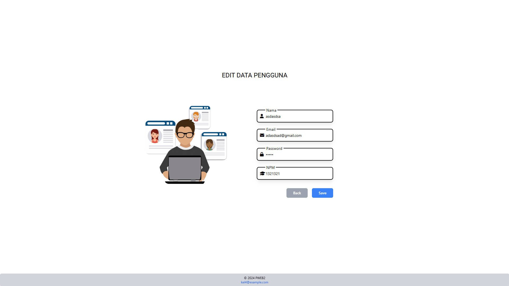

## Dashboard
<p>Dashboard merupakan antarmuka pengguna yang menyajikan informasi penting secara ringkas dan visual, dashboard ini sendiri biasanya dalam bentuk grafik, tabel, atau indikator utama.<br>Dashboard yang ada pada kali ini berisi seperti ucapan selamat datang (Welcome), dan terdapat beberapa card yang di dalamnya berisi sebuah tombol see detail yang nantinya pengguna akan menekan see detail pada salah satu card.</p>

<h4> - Navbar</h4>

```html
<div class="w-11/12 bg-gray-300 rounded-md p-3 shadow-md">
    <h2 class="text-center text-black font-semibold text-2xl">WELCOME</h2>
</div>
```

potongan program ini digunakan untuk memunculkan navbar yang berisi kata "WELCOME".

<h4> - Card </h4>

```html
<div class="flex justify-center items-center min-h-[72vh] space-x-20">
<!-- Col 1 -->
<div class="w-72 h-96 bg-gray-300 rounded-md p-3 shadow-md shadow-md hover:shadow-lg hover:scale-105 transition duration-300">
    <div class="flex justify-center">
        
        </div>
        <p class="text-gray-600 text-sm mt-2">Manajemen Anggota Perpustakaan:  kelola data anggota seperti nama, email, password, dan nomor anggota</p>
        <h3 class="text-center text-black mt-12 font-semibold text-2xl">User</h3>
        <button class="w-24 h-8 bg-blue-500 text-white text-sm font-medium rounded-md hover:bg-blue-600 mt-12"><a href="/user/index">See Details</a></button>
    </div>
<!-- Col 2 -->
    <div class="w-72 h-96 bg-gray-300 rounded-md p-3 shadow-md shadow-md hover:shadow-lg hover:scale-105 transition duration-300">
        <div class="flex justify-center">
            
        </div>
        <p class="text-gray-600 text-sm mt-2">Kelola Data Buku Perpustakaan: Tambah, ubah, hapus, dan kelola data buku seperti judul, penulis,tahun terbit, dan genre.</p>
        <h3 class="text-center text-black mt-12 font-semibold text-2xl">Books</h3>
        <button class="w-24 h-8 bg-blue-500 text-white text-sm font-medium rounded-md hover:bg-blue-600 mt-12">See Details</button>
    </div>
<!-- Col 3 -->
    <div class="w-72 h-96 bg-gray-300 rounded-md p-3 shadow-md shadow-md hover:shadow-lg hover:scale-105 transition duration-300">
        <div class="flex justify-center">
            
        </div>
        <p class="text-gray-600 text-sm mt-2">Kelola Data Penerbit Buku: Tambah, ubah, hapus, dan kelola data penerbit seperti nama penerbit, alamat, dan kontak penerbit.</p>
        <h3 class="text-center text-black mt-8 font-semibold text-2xl">Publisher</h3>
        <button class="w-24 h-8 bg-blue-500 text-white text-sm font-medium rounded-md hover:bg-blue-600 mt-11">See Details</button>
    </div>
    <!-- Col 4 -->
    <div class="w-72 h-96 bg-gray-300 rounded-md p-3 shadow-md shadow-md hover:shadow-lg hover:scale-105 transition duration-300">
        <div class="flex justify-center">
            
        </div>
        <p class="text-gray-600 text-sm mt-2">Kelola Data Peminjaman Buku: Tambah, ubah, hapus, dan kelola data peminjaman buku seperti nama peminjam, judul buku, tanggal peminjaman, dan tanggal pengembalian.</p>
        <h3 class="text-center text-black mt-1 font-semibold text-2xl">Loans</h3>
        <button class="w-24 h-8 bg-blue-500 text-white text-sm font-medium rounded-md hover:bg-blue-600 mt-11">See Details</button>
    </div>
</div>
```
<p>Potongan program di atas ini digunakan untuk membuat card yang berada di bagian bawah navbar, card ini juga digunakan untuk pengguna memilih untuk menuju ke halaman yang lain.</p>

<h4> - Footer </h4>

```html
<div class="fixed bottom-0 w-full h-12 bg-gray-300 rounded-md p-2 shadow-md">
        <div class="flex justify-center items-center h-full">
            <footer class="text-xs text-center">
                <p>© 2024 PWEB2<br><a href="mailto:Kel4@example.com" class="text-blue-600 hover:underline flex items-center gap-1"> kel4@example.com</a></p>
            </footer>
        </div>
    </div>
```

<p> Potongan program di atas digunakan untuk membuat footer pada sebuah halaman website.</p>

<h3> Output </h3>


<hr>

## Index

<p>Pada bagian Index ini berisi tabel Data User yang terdiri dari Nama, Email, Password, dan NPM.</p>

<h4> - Add & Search</h4>

```html
<div class="mt-24 w-3/4">
    <div class="flex justify-end gap-2 items-center">
        <a href="/user/create" class="px-5 py-3 bg-blue-500 text-white font-semibold text-sm rounded-lg hover:bg-blue-600 transition duration-300"><i class="fa fa-plus mr-2"></i>Add</a>
            <div class="relative">
                <input type="text" id="searchInput" placeholder="Cari data..." class="w-48 pl-10 px-4 py-2 border-2 border-gray-300 rounded-lg focus:outline-none focus:ring-2 focus:ring-blue-500">
                    <span class="absolute left-3 top-1/2 transform -translate-y-1/2 text-gray-400">
                    <i class="fas fa-search"></i>
                    </span>
            </div>
    </div>
</div>
```

<p>Potongan program di atas digunakan untuk menambahkan dan mencari data yang ada pada tabel. </p>

<h4> - Tabel</h4>

```html
<table id="users" class="mt-2 table-auto w-3/4 rounded-lg shadow-lg overflow-hidden text-sm text-left">
    <thead>
        <tr class="bg-gray-300 justify-center">
            <th class="px-4 py-2 text-center">Nama</th>
            <th class="px-4 py-2 text-center">Email</th>
             <th class="px-4 py-2 text-center">Password</th>
            <th class="px-4 py-2 text-center">NPM</th>
            <th class="px-4 py-2 text-center">Actions</th>
        </tr>
    </thead>
    <tbody>
        <?php foreach ($users as $user): ?>
            <tr class="odd:bg-gray-100 even:bg-gray-200 hover:bg-gray-300 border-b border-gray-300">
                <td class="px-4 py-2 text-center"><?= htmlspecialchars($user['nama_user']) ?></td>
                <td class="px-4 py-2 text-center"><?= htmlspecialchars($user['email']) ?></td>
                <td class="px-4 py-2 text-center"><?= htmlspecialchars($user['password']) ?></td>
                <td class="px-4 py-2 text-center"><?= htmlspecialchars($user['no_anggota']) ?></td>
                <td class="px-4 py-2 text-center">
                    <a href="/user/edit/<?php echo $user['id_user']; ?>" class="inline-block px-4 py-2 bg-blue-500 text-white font-semibold text-sm rounded-lg hover:bg-blue-600 focus:outline-none focus:ring-2 focus:ring-blue-500"><i class="fa fa-pen mr-2"></i>Edit</a>
                    <a href="/user/delete/<?php echo $user['id_user']; ?>" id="delete" class="inline-block px-4 py-2 bg-red-500 text-white font-semibold text-sm rounded-lg hover:bg-red-600 focus:outline-none focus:ring-2 focus:ring-red-500"><i class="fa fa-trash mr-2"></i>Delete</a>
                </td>
            </tr>
        <?php endforeach; ?>
    </tbody>
</table>
```
<p>Potongan program di atas digunakan untuk membuat tabel, membaca data dari database yang ada dan menambahkan button untuk edit dan hapus pada suatu data yang ada.</p>

<h4> - Footer</h4>

```html
<div class="fixed bottom-0 w-full h-12 bg-gray-300 rounded-md p-2 shadow-md">
    <div class="flex justify-center items-center h-full">
        <footer class="text-xs text-center">
            <p>© 2024 PWEB2<br><a href="mailto:Kel4@example.com" class="text-blue-600 hover:underline flex items-center gap-1"> kel4@example.com</a></p>
        </footer>
    </div>
</div>
```

<h4>Potongan program di atas digunakan untuk membuat footer sebuah halaman website</h4>

<h3>Output</h3>

<hr>

## Create
<p>Create ini digunakan untuk menambahkan data user seperti nama, email, password, dan no anggota(NPM)</p>

```html
<!-- Nama -->
<label class="relative flex items-center w-full">
    <i class="fas fa-user absolute left-3 text-black"></i>
    <input required type="text" name="nama_user" id="nama_user" class="w-72 pr-3 pl-8 py-2 h-12 text-sm outline-none border-2 border-black rounded-lg hover:border-gray-600 duration-200 peer focus:border-indigo-600 bg-inherit shadow-lg">
    <span class="absolute left-6 top-3 px-1 text-m tracking-wide peer-focus:text-indigo-600 pointer-events-none duration-200 peer-focus:text-sm peer-focus:-translate-y-5 bg-white ml-2 peer-valid:text-sm peer-valid:-translate-y-5">Nama</span>
</label>

<!-- Email -->
<label class="relative flex items-center w-full">
    <i class="fas fa-envelope  absolute left-3 text-black"></i>
    <input required type="email"  name="email" id="email" class="w-72 pr-3 pl-8 py-2 h-12 text-sm outline-none border-2 border-black rounded-lg hover:border-gray-600 duration-200 peer focus:border-indigo-600 bg-inherit shadow-lg">
    <span class="absolute left-6 top-3 px-1 text-m tracking-wide peer-focus:text-indigo-600 pointer-events-none duration-200 peer-focus:text-sm peer-focus:-translate-y-5 bg-white ml-2 peer-valid:text-sm peer-valid:-translate-y-5">Email</span>
</label>

<!-- Password -->
<label class="relative flex items-center w-full">
    <i class="fas fa-lock absolute left-3 text-black"></i>
    <input required type="password" name="password" id="password" class="w-72 pr-3 pl-8 py-2 h-12 text-sm outline-none border-2 border-black rounded-lg hover:border-gray-600 duration-200 peer focus:border-indigo-600 bg-inherit shadow-lg">
    <span class="absolute left-6 top-3 px-1 text-m tracking-wide peer-focus:text-indigo-600 pointer-events-none duration-200 peer-focus:text-sm peer-focus:-translate-y-5 bg-white ml-2 peer-valid:text-sm peer-valid:-translate-y-5">Password</span>
</label>

<!-- NPM -->
<label class="relative flex items-center w-full">
    <i class="fas fa-graduation-cap absolute left-3 text-black"></i>
    <input required type="text" pattern="\d*" name="no_anggota" id="no_anggota"  class="w-72 pr-3 pl-8 py-2 h-12 text-sm outline-none border-2 border-black rounded-lg hover:border-gray-600 duration-200 peer focus:border-indigo-600 bg-inherit shadow-lg" oninput="this.value=this.value.replace(/\D/g,'')">
    <span class="absolute left-6 top-3 px-1 text-m tracking-wide peer-focus:text-indigo-600 pointer-events-none duration-200 peer-focus:text-sm peer-focus:-translate-y-5 bg-white ml-2 peer-valid:text-sm peer-valid:-translate-y-5">NPM</span>
</label>
```
<p>Di atas ini merupakan potongan program untuk menambah form input data.</p>

<h3>Output</h3>


<hr>

## Edit
<p>Edit ini digunakan untuk mengubah data user seperti nama, email, password, dan no anggota(NPM)</p>

```html
<div class="flex mt-12 items-center justify-center w-full">
    
    <div class="flex flex-col gap-6 w-full max-w-md">
        <!-- Nama -->
        <label class="relative flex items-center w-full">
            <i class="fas fa-user absolute left-3 text-black"></i>
            <input required type="text" name="nama_user" id="nama_user" value="<?php echo $id_user['nama_user']; ?>" class="w-72 pr-3 pl-8 py-2 h-12 text-sm outline-none border-2 border-black rounded-lg hover:border-gray-600 duration-200 peer focus:border-indigo-600 bg-inherit shadow-lg">
            <span class="absolute left-6 top-3 px-1 text-m tracking-wide peer-focus:text-indigo-600 pointer-events-none duration-200 peer-focus:text-sm peer-focus:-translate-y-5 bg-white ml-2 peer-valid:text-sm peer-valid:-translate-y-5">Nama</span>
        </label>
        <!-- Email -->
        <label class="relative flex items-center w-full">
            <i class="fas fa-envelope  absolute left-3 text-black"></i>
            <input required type="email"  name="email" id="email" value="<?php echo $id_user['email']; ?>" class="w-72 pr-3 pl-8 py-2 h-12 text-sm outline-none border-2 border-black rounded-lg hover:border-gray-600 duration-200 peer focus:border-indigo-600 bg-inherit shadow-lg">
            <span class="absolute left-6 top-3 px-1 text-m tracking-wide peer-focus:text-indigo-600 pointer-events-none duration-200 peer-focus:text-sm peer-focus:-translate-y-5 bg-white ml-2 peer-valid:text-sm peer-valid:-translate-y-5">Email</span>
        </label>
        <!-- Password -->
        <label class="relative flex items-center w-full">
            <i class="fas fa-lock absolute left-3 text-black"></i>
            <input required type="password" name="password" id="password" value="<?php echo $id_user['password']; ?>" class="w-72 pr-3 pl-8 py-2 h-12 text-sm outline-none border-2 border-black rounded-lg hover:border-gray-600 duration-200 peer focus:border-indigo-600 bg-inherit shadow-lg">
            <span class="absolute left-6 top-3 px-1 text-m tracking-wide peer-focus:text-indigo-600 pointer-events-none duration-200 peer-focus:text-sm peer-focus:-translate-y-5 bg-white ml-2 peer-valid:text-sm peer-valid:-translate-y-5">Password</span>
        </label>
        <!-- NPM -->
        <label class="relative flex items-center w-full">
            <i class="fas fa-graduation-cap absolute left-3 text-black"></i>
            <input required type="text" pattern="\d*" name="no_anggota" id="no_anggota" value="<?php echo $id_user['no_anggota']; ?>" class="w-72 pr-3 pl-8 py-2 h-12 text-sm outline-none border-2 border-black rounded-lg hover:border-gray-600 duration-200 peer focus:border-indigo-600 bg-inherit shadow-lg" oninput="this.value=this.value.replace(/\D/g,'')" maxlength="10">
            <span class="absolute left-6 top-3 px-1 text-m tracking-wide peer-focus:text-indigo-600 pointer-events-none duration-200 peer-focus:text-sm peer-focus:-translate-y-5 bg-white ml-2 peer-valid:text-sm peer-valid:-translate-y-5">NPM</span>
        </label>
        <div class="flex gap-4 mt-2 ml-28">
            <!-- Tombol Back (Link) -->
            <a href="../index" class="w-20 h-9 bg-gray-400 text-white text-sm font-medium rounded-md hover:bg-gray-500 transition duration-300 text-center flex items-center justify-center">Back</a>
            <!-- Tombol Add -->
            <button type="submit" class="w-20 h-9 bg-blue-500 text-white text-sm font-medium rounded-md hover:bg-blue-600 transition duration-300">Save</button>
        </div>
    </div>
    <div class="fixed bottom-0 w-full h-12 bg-gray-300 rounded-md p-2 shadow-md">
        <div class="flex justify-center items-center h-full">
            <footer class="text-xs text-center">
                <p>© 2024 PWEB2<br><a href="mailto:Kel4@example.com" class="text-blue-600 hover:underline flex items-center gap-1"> kel4@example.com</a></p>
            </footer>
        </div>
    </div>
</div>
```
<p>Berbeda dengan form input, pada bagian edit ini terdapat data yang muncul di bagian inputnya.</p>

<h3>Output</h3>

<hr>

## User Models

```php
<?php
require_once '../config/database.php';

class User {
    private $db;

    public function __construct(){
        $this->db = (new Database())->connect();
    }

    public function getAllUsers(){
        $query = $this->db->query("SELECT * FROM users");
        return $query->fetchAll(PDO::FETCH_ASSOC);
    }

    public function findUser($id_user) {
        $query = $this->db->prepare("SELECT * FROM users WHERE id_user = :id_user");
        $query->bindParam(':id_user', $id_user, PDO::PARAM_INT);
        $query->execute();
        return $query->fetch(PDO::FETCH_ASSOC);
    }

    public function addUser($nama_user, $email, $password, $no_anggota){
        $query = $this->db->prepare("INSERT INTO users (nama_user, email, password, no_anggota) values (:nama_user, :email, :password, :no_anggota)");
        $query->bindParam(':nama_user', $nama_user);
        $query->bindParam(':email', $email);
        $query->bindParam(':password', $password);
        $query->bindParam(':no_anggota', $no_anggota);
        return $query->execute();
    }

    public function updateUser($id_user, $data){
        $query = "UPDATE users SET nama_user = :nama_user, email = :email, password = :password, no_anggota = :no_anggota WHERE id_user = :id_user";
        $stmt = $this->db->prepare($query);
        $stmt->bindParam(':nama_user', $data['nama_user']);
        $stmt->bindParam(':email', $data['email']);
        $stmt->bindParam(':password', $data['password']);
        $stmt->bindParam(':no_anggota', $data['no_anggota']);
        $stmt->bindParam(':id_user', $id_user);
        return $stmt->execute();
    }

    public function deleteUser($id_user){
        $query = "DELETE from users WHERE id_user = :id_user";
        $stmt = $this->db->prepare($query);
        $stmt->bindParam(':id_user', $id_user);
        return $stmt->execute();
    }
}
```

<p>Potongan program di atas merupakan program pada file User yang ada di folder models dan ini berisi beberapa function untuk memproses semua data yang ada di database, seperti menambah, mengupdate, menghapus, dan mencari data user.</p>
<hr>

## User Controller

```php
<?php
// app/controllers/UserController.php
require_once '../app/models/User.php';

class UserController {
    private $userModel;

    public function __construct() {
        $this->userModel = new User();
    }

    public function dashboard() {
        $users = $this->userModel->getAllUsers();
        require_once '../app/views/dashboard.php';

    }

    public function index() {
        $users = $this->userModel->getAllUsers();
        require_once '../app/views/user/index.php';

    }

    public function create() {
        require_once '../app/views/user/create.php';
    }

    public function store() {
        $nama_user = $_POST['nama_user'];
        $email = $_POST['email'];
        $password = $_POST['password'];
        $no_anggota = $_POST['no_anggota'];
        $this->userModel->addUser($nama_user, $email, $password, $no_anggota);
        header('Location: /user/index');
    }
    // Show the edit form with the user data
    public function edit($id_user) {
        $id_user = $this->userModel->findUser($id_user);
        require_once __DIR__ . '/../views/user/edit.php';
    }

    // Process the update request
    public function update($id_user, $data) {
        $updated = $this->userModel->updateUser($id_user, $data);
        if ($updated) {
            header("Location: /user/index"); // Redirect to user list
        } else {
            echo "Failed to update user.";
        }
    }

    // Process delete request
    public function deleteUser($id_user) {
        $deleted = $this->userModel->deleteUser($id_user);
        if ($deleted) {
            header("Location: /user/index"); // Redirect to user list
        } else {
            echo "Failed to delete user.";
        }
    }
}
```
<p>Potongan program yang ada di UserController ini digunakan untuk menerima input dari user yang kemudian data tersebut akan diolah menggunakan model lalu mengirimkan kembali data ke view.</p>
# Tugas 3 Pemrogaman Web 2

### Nama: Nalindra Driyawan Thahai
### NPM: 21090069
### Kelas: TI-2C

<HR>

## config/Database.php

<div align="justify">
File database.php memiliki fungsi yang sama seperti koneksi.php yang biasanya digunakan untuk menyambungkan tabel/system dengan database. Selain fungsi di atas, file database tidak diperbolehkan memiliki fungsi lain

<br>
isi file:

- Pembuatan Class
```php
class Database {
    private $host = '160.19.166.42';
    private $db_name = '2C_klp4';
    private $username = '2C_klp4';
    private $password = 'sh4C@0Ya(.ti*Rob';
    private $conn;
```
Potongan coding diatas berfungsi untuk pembuatan class Database serta atribut nya

- Pembuatan Method

```php

public function connect() {
        $this->conn = null;
        try {
            $this->conn = new PDO("mysql:host=" . $this->host . ";dbname=" . $this->db_name, $this->username, $this->password);
            $this->conn->setAttribute(PDO::ATTR_ERRMODE, PDO::ERRMODE_EXCEPTION);
        } catch(PDOException $e) {
            echo "Connection error: " . $e->getMessage();
        }
        return $this->conn;
    }
}
```
Dalam potongan coding diatas berisi pembuatan method/fungsi connect yang digunakan untuk menghubungkan table dengan database yang tertuju. PDO disini berfungsi untuk menggantikan mysqli karena kita menggunakan MVC

<hr>

## models/Loans.php

Dalam folder model biasanya berisi file yang digunakan untuk mengelola data. Di kasus ini folder models berisi file dengan nama loans.php, file ini berisi berbagai method yang bersangkut paut dengan pengelolaan database seperti insert,select dll

<br>
isi file:

- Pembuatan Class
```php
class loans {
    private $db;

    public function __construct() {
        $this->db = (new Database())->connect();
    }

```
    Potongan coding diatas berfungsi untuk membuat instance dari class Database dan menghubungkan dengan connect

- Pembuatan berbagai Method

```php
    public function getAllLoans() {
        $query = $this->db->query("SELECT loans.id_peminjaman, loans.tgl_pinjam, loans.tgl_kembali, 
                                users.nama_user, books.judul FROM  loans INNER JOIN users ON loans.id_user = users.id_user
                                INNER JOIN books ON loans.id_buku = books.id_buku");
        return $query->fetchAll(PDO::FETCH_ASSOC);
```
Berfungsi untuk melakukan pengambilan data menggunakan inner join dari 2 table berbeda yaitu table users dan books. Hal ini bisa dilakukan karena adanya foreign key yang terdapat pada table loan yang merupakan primary key di table lain.

```php
public function getAllUsers() {
        $query = $this->db->query("SELECT * FROM users");
        return $query->fetchAll(PDO::FETCH_ASSOC);
    }
    public function getAllBooks() {
        $query = $this->db->query("SELECT * FROM books");
        return $query->fetchAll(PDO::FETCH_ASSOC);
```
Berfungsi untuk memanggil semua data uang berada di table books dan users

```php
    public function find($id_peminjaman) {
        $query = $this->db->prepare("SELECT * FROM loans WHERE id_peminjaman = :id_peminjaman");
        $query->bindParam(':id_peminjaman', $id_peminjaman, PDO::PARAM_INT);
        $query->execute();
        return $query->fetch(PDO::FETCH_ASSOC);
    }
```
Berfungsi untuk mencari data table sesuai dengan id nya

```php
public function add($tgl_pinjam, $tgl_kembali, $id_user, $id_buku) {
        $query = $this->db->prepare("INSERT INTO loans (tgl_pinjam,tgl_kembali,id_user,id_buku) VALUES (:tgl_pinjam, :tgl_kembali, :id_user, :id_buku)");
        $query->bindParam(':tgl_pinjam', $tgl_pinjam);
        $query->bindParam(':tgl_kembali', $tgl_kembali);
        $query->bindParam(':id_user', $id_user);
        $query->bindParam(':id_buku', $id_buku);
        return $query->execute();
    }
```
Berfungsi untuk menambahkan data ke dalam table di database

```php
public function update($id_peminjaman, $data) {
        $query = "UPDATE loans SET tgl_pinjam = :tgl_pinjam, tgl_kembali = :tgl_kembali, id_user = :id_user, id_buku = :id_buku WHERE id_peminjaman = :id_peminjaman";
        $stmt = $this->db->prepare($query);
        $stmt->bindParam(':tgl_pinjam', $data['tgl_pinjam']);
        $stmt->bindParam(':tgl_kembali', $data['tgl_kembali']);
        $stmt->bindParam(':id_user', $data['id_user']);
        $stmt->bindParam(':id_buku', $data['id_buku']);
        $stmt->bindParam(':id_peminjaman', $id_peminjaman);
        return $stmt->execute();
    }
```
Berfungsi untuk mengubah data dalam table di database

```php
    public function delete($id_peminjaman) {
        $query = "DELETE FROM loans WHERE id_peminjaman = :id_peminjaman";
        $stmt = $this->db->prepare($query);
        $stmt->bindParam(':id_peminjaman', $id_peminjaman);
        return $stmt->execute();
    }
```
Berfungsi untuk menghapus data dalam table di database

<hr>

## controllers/LoansControlles

Berfungsi untuk mengelola logika pengguna, biasanya digunakan untuk pengelolaan table dalam sistem

- Beberapa method :

```php
    public function dashboard() {
        require_once '../app/views/dashboard.php';
    }
```
Berfungsi untuk menampilkan halaman dashboard sesuai route yang ditentukan

```php
public function index() {
        $loan = $this->loansModel->getAllLoans();
        require_once '../app/views/loans/index.php';
    }


    public function create() {
        $users = $this->loansModel->getAllUsers();
        $users1 = $this->loansModel->getAllBooks();
        require_once '../app/views/loans/create.php';
    }
        public function edit($id_peminjaman) {
        $loans1 = $this->loansModel->find($id_peminjaman);
        $users = $this->loansModel->getAllUsers();
        $books = $this->loansModel->getAllBooks();
        require_once __DIR__ . '/../views/loans/edit.php';
    }
```
Ketiga method diatas memiliki fungsi yang sama yaitu untuk memanggil data sesuai kebutuhan misalkan dalam create() terdapa get all users dan books karena dalam from di create() terdapat dropdown yang dipanggil dari table users dan books.

```php
public function store() {
        $id_user = $_POST['id_user'];
        $tgl_kembali = $_POST['tgl_kembali'];
        $tgl_pinjam = $_POST['tgl_pinjam'];
        $id_buku = $_POST['id_buku'];
        $tgl_kembali = $_POST['tgl_kembali'];
        $this->loansModel->add( $tgl_pinjam, $tgl_kembali, $id_user, $id_buku);
        header('Location: /loans/index');
    }
```
Berfungsi untuk menambahkan data ke dalam table loans sesuai dengan data yang diinputkan

```php
public function update($id_peminjaman, $data) {
        $updated = $this->loansModel->update($id_peminjaman, $data);
        if ($updated) {
            header("Location: /loans/index"); // Redirect to user list
        } else {
            echo "Failed to update loans.";
        }
    }
```
Berfungsi untuk men


</div>